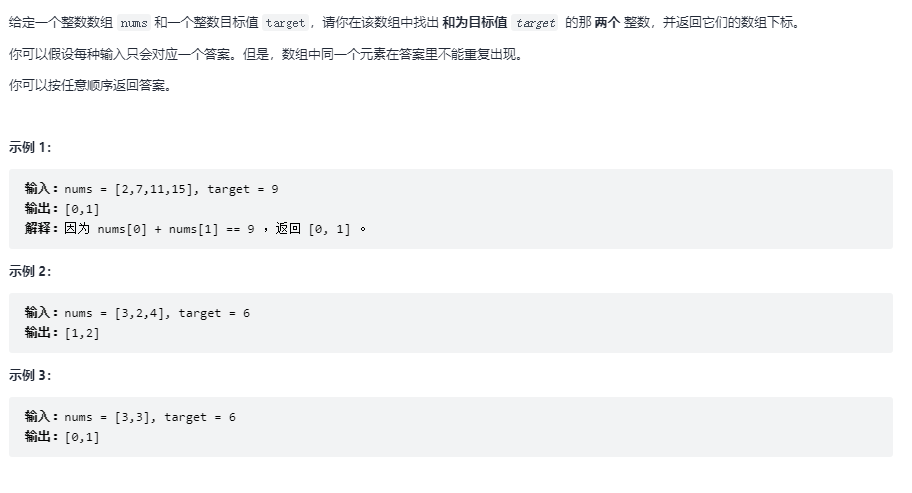
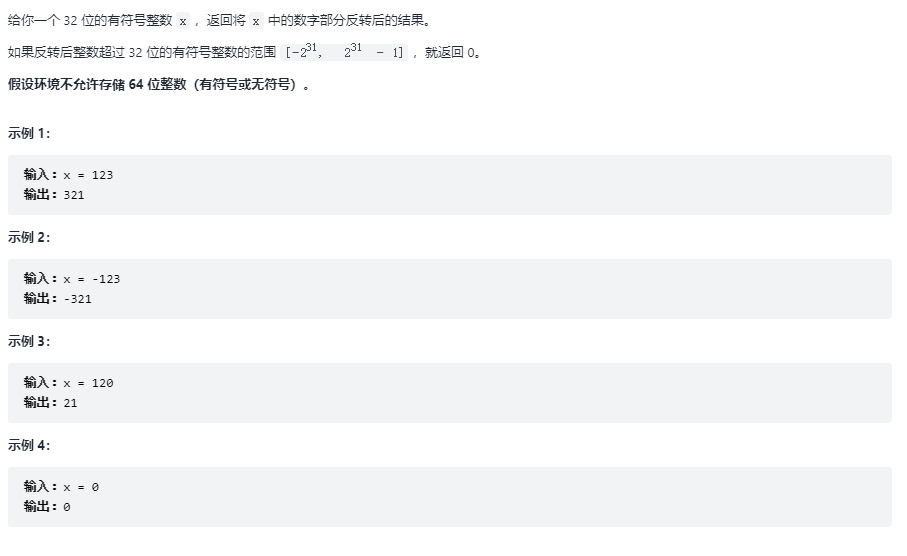
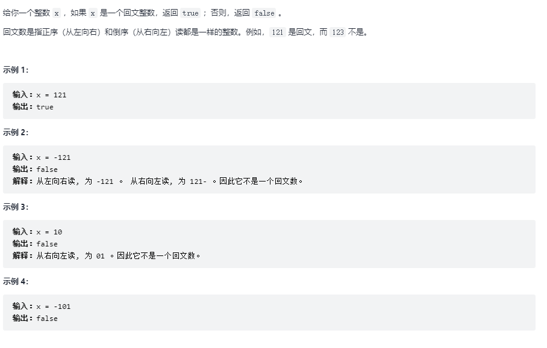
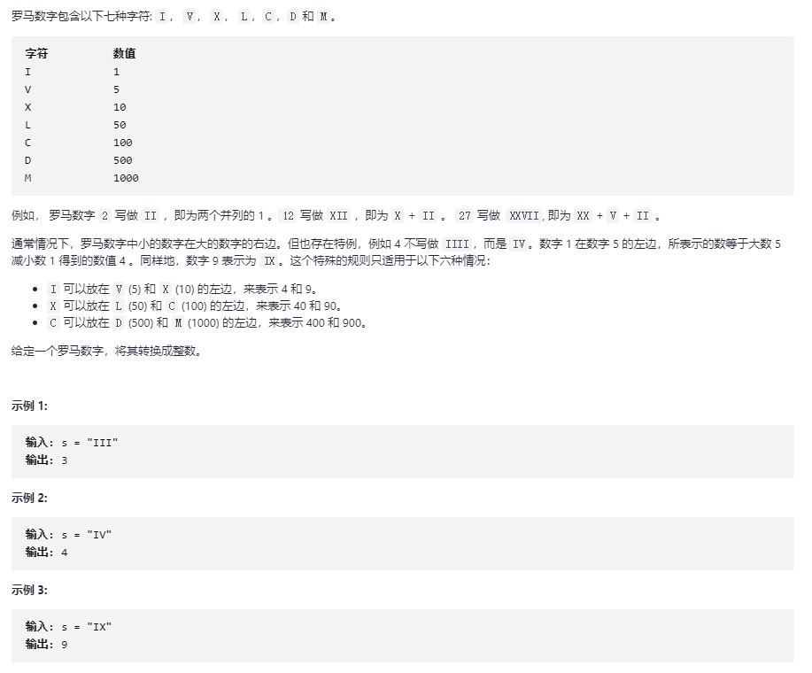
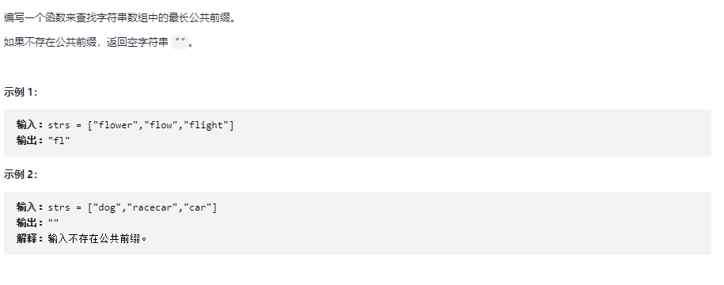
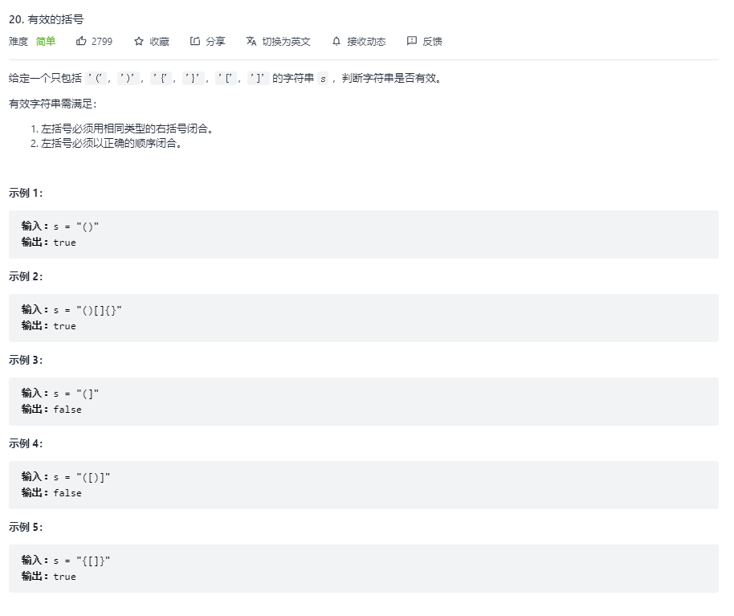

# 力扣算法题(JavaScript)

## 1. 介绍

> https://leetcode-cn.com/problemset/all/

用JavaScript实现力扣算法题

解题网站：https://programmercarl.com/

## 2. 两数之和

第一种：最简单粗暴

~~~js
/**
 * @param {number[]} nums
 * @param {number} target
 * @return {number[]}
 */
var twoSum = function(nums, target) {
    let arr_length = nums.length;

    for (let i = 0; i < arr_length; i++) {
        for (let z = 1; z < arr_length; z++) {
            if (nums[i] + nums[z] == target) {
                return [i, z];
            }
        }
    }
};

console.log(twoSum([1, 2, 3, 6], 7));

//	Console Print
//	(2) [0, 3]
~~~

第二种：我们换个思维，假设有这么个数组[2,3,5,6]，target为8，我们将已经循环了的值存到对象里，然后将target减去当前循环的值查看对象里是否存在，如果存在则代表两数之和等于target

~~~js
/**
 * @param {number[]} nums
 * @param {number} target
 * @return {number[]}
 */
var twoSum = function(nums, target) {
    let hash = {};	// {3: 0, 8: 1}
    for (let i = 0; i < nums.length; i++) {
        if (hash[target - nums[i]] !== undefined) {	// 18 - 10 = 8
            return [i, hash[target - nums[i]]];	
        }
        hash[nums[i]] = i;
    }
    return [];
};

console.log(twoSum([3, 8, 10, 15], 18));

// Console Print
//	(2) [2, 1]
~~~

## 3. 整数反转

补习知识点：

~~~js
// 32位有符号整数范围为	-2147483648 ~ 2147483647
console.log(Math.pow(2, 3));	// 2的3次方 Print 8
console.log(~~123);	// 执行两次按位取反，其实就是保持原值	Print 123
console.log(~~(123/10));	// 去掉小数点 Print 12
console.log(123%10);	// 获得最后一位数字 Print 3
~~~

第一种：数字 -> 分裂为数组 -> 反转 -> 拼接为字符串 -> 强转为数字

~~~js
/**
* @param {number} x
* @return {number}
*/
var reverse = function (x) {
    var max = Math.pow(2, 31) - 1;
    var min = -Math.pow(2, 31);
    let y = 0;

    let arr = String(x).split("")  
    arr.reverse(); 

    if (arr[arr.length - 1] == '-') {   
        arr.pop()  
        arr.unshift('-'); 
    } else if (arr[0] == 0) {  
        arr.shift();
    }

    y = Number(arr.join(''));

    if(y > max || y < min) return 0;
    return y;
};

console.log(reverse(1534236469));
console.log(reverse(123456));

// Console Print
//	0
//	654321
~~~

第二种：

~~~js
// 这个做的非常巧妙
var reverse2 = function (x) {
    var max = Math.pow(2, 31) - 1;
    var min = -Math.pow(2, 31);
    var y = 0;

    while(x !==0){
        y = 10 * y + x % 10;   
        x = ~~(x/10);   // 去掉小数点,这里的功能就是慢慢减少一位，1234一个循环后就变成123
        // x =  Math.floor(x/10);
    }

    if(y > max || y < min) return 0;
    return y;
}

console.log(reverse2(1534236469));
console.log(reverse2(123456));

// Console Print
//	0
//	654321
~~~

## 4. 判断回文数

第一种：数字 -> 强转为字符串 -> 切割为数组 -> 反转数组 -> 拼接为字符串 -> 强转为数字

~~~js
var isPalindrome = function (x) {
    let y = Number((String(x).split("").reverse()).join(""));
    if(y === x){
        return true;
    }
    return false;

};

console.log(isPalindrome(121));
console.log(isPalindrome(-121));
console.log(isPalindrome(10));

// Console Print
// true
// false
// false
~~~

第二种：

~~~js
var isPalindrome2 = function (x) {
    if (x === 0) return true
    if (x < 0 || x % 10 === 0) return false
    let r = 0
    let t = x
    do {
        r = r * 10 + t % 10 // 1  12   121
        t = Math.floor(t / 10)  // 12 1 0
    } while (t)	// 当r全部反转之后t就为0
    return x === r
};
~~~

## 5. 罗马数转整数

第一种：

~~~js
var romanToInt = function (s) {
    let xuan = s.split("");
    let count = 0;
    const hash = {
        'I': 1,
        'V': 5,
        'X': 10,
        'L': 50,
        'C': 100,
        'D': 500,
        'M': 1000,
    }

    for (let i = 0; i < xuan.length; i++) {
        if (hash[xuan[i]] < hash[xuan[i + 1]]) {
            count += hash[xuan[i + 1]] - hash[xuan[i]];
            i += 1;
        } else {
            count += (hash[xuan[i]]);
        }
    }
    return count
};

console.log(romanToInt('IX'));

// Console Print
// 9
~~~

## 6. 最长公共前缀

补习知识点：

~~~js
var ages = [32, 33, 16, 40];

ages.every(function (e){ // 如果里面返回的都是true那么就为true，如果有一个不是则为false
    console.log(e);	// 32
    return false;	// 惰性
})

ages.every(function (e){	
    console.log(e);	// 32 33 16 40
    return false;
})
~~~

第一种：

~~~js
var longestCommonPrefix = function (strs) {
    let res = "";
    for (let i = 0; i < strs[0].length; i++) {
        let bool = strs.every(s => strs[0][i] == s[i]);
        if (bool) {
            res += strs[0][i]
        }else{
            break;
        }

    }
    return res;
};

console.log(longestCommonPrefix(["flower","flow","flight"]));	// fl
console.log(longestCommonPrefix(['a','a','b']));	// ''
console.log(longestCommonPrefix(['aab','aa','aabb']));	// aa
~~~

## 7. 有效的括号

补习知识点：

~~~js
let str1 = 'xxuan xxiao qian'
let str2 = str1.replace('xx', 'x')
let str3 = str1.replace('xx', 'x').replace('xx', 'x')
let str4= str1.replace(/xx/g, 'x')

console.log(str2);	// xuan xxiao qian
console.log(str3);	// xuan xiao qian
console.log(str4);	// xuan xiao qian
~~~

第一种：

~~~js
function w(s) {
    let length = s.length / 2;
    for (let  i = 0; i < length; i++) {
        s = s.replace("()", "").replace("{}", "").replace("[]", "");
    }

    return s.length == 0;
}
console.log(w("[{((][]))}]"));	// false
console.log(w("[}{}]"));	// false
console.log(w("[{(]}]"));	// false
~~~

第二种：模拟栈

~~~js
var isValid3 = function (s) {
    const stack = [];
    for (let i = 0; i < s.length; i++) {
        let c = s[i];
        switch (c) {
            case '(':
                stack.push(')');
                break;
            case '[':
                stack.push(']');
                break;
            case '{':
                stack.push('}');
                break;
            default:
                if (c !== stack.pop()) {	// 这个不仅会判断，还会弹出数组最后一个元素
                    return false;
                }

        }
    }
    return stack.length === 0;
};
~~~

~~~js
//	map简化
var isValid = function (s) {
    const stack = [],
          map = {
              "(": ")",
              "{": "}",
              "[": "]"
          };
    for (const x of s) {
        console.log("x",x);
        if (x in map) {
            console.log("y",x);
            stack.push(x);
            continue;
        };
        if (map[stack.pop()] !== x) return false;
    }   
    return !stack.length;
};
~~~

