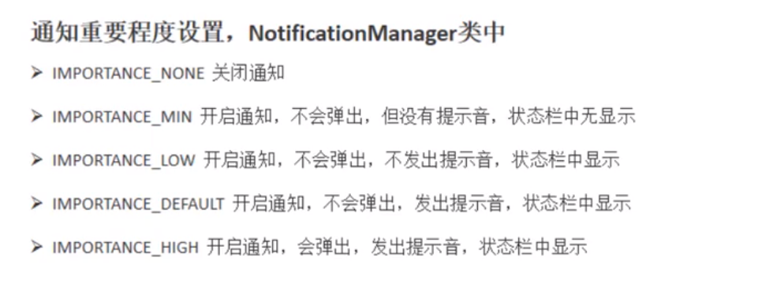
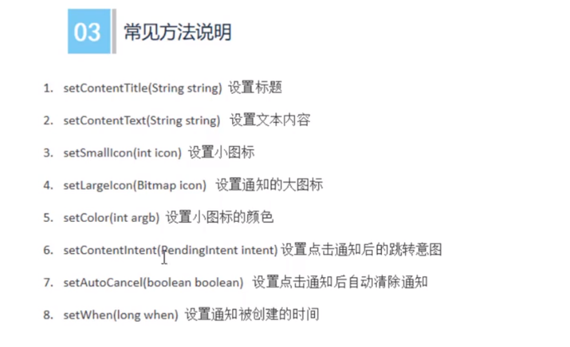
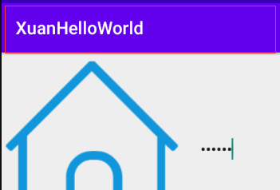
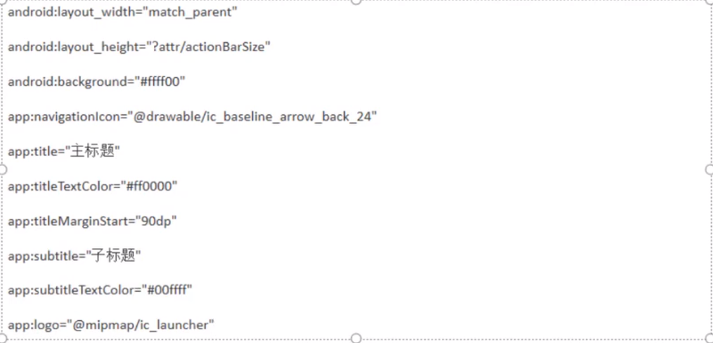
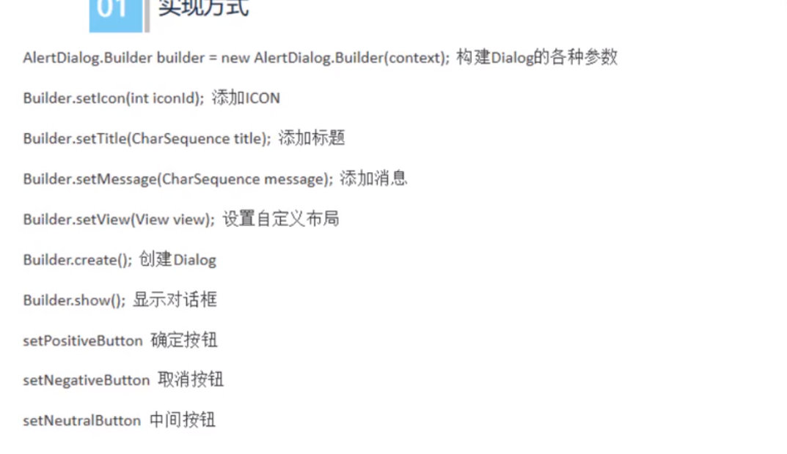
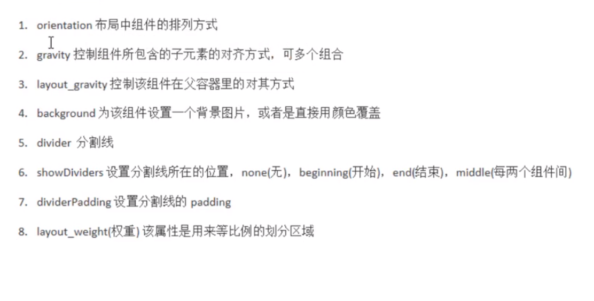
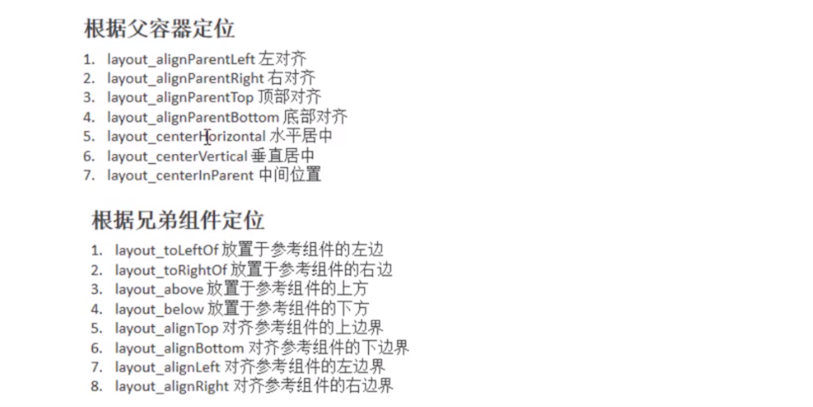
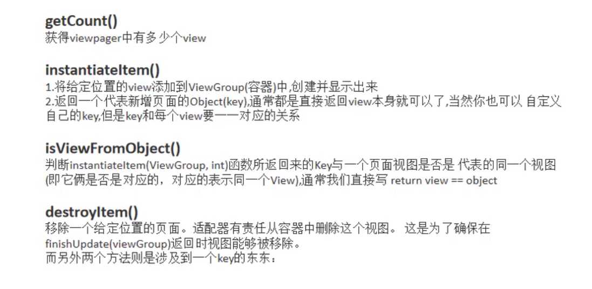

#  Android

> https://www.runoob.com/w3cnote/android-tutorial-imageview.html 菜鸟

## 1. TextView

> TextView是用来显示字符串的组件，在手机上就是显示一块文本的区域。

### 1. 基础使用

~~~java
layout_width:组件的宽度

layout_height:组件的高度
    
id:为TextView设置一个组件id(唯一ID)
    
text:设置显示文本内容
    
textColor:设置字体颜色
    
textStyle:设置字体风格,三种可选择:normal(无效果),bold(加粗),italic(斜体)
    
textSize:字体大小，单位一般都是用sp
    
background:控件的背景颜色

gravity:设置内容的对齐方式

~~~

~~~xml
    <TextView
        android:id="@+id/tv1"
        android:layout_width="match_parent"
        android:layout_height="wrap_content"
        android:text="我是断悦"
        android:textColor="#055"
        android:textSize="50sp"
        android:gravity="center"
        android:textStyle="italic"
        android:background="#8CD3EC"
        />
~~~

**效果图:** 

------

### 2. 带阴影的TextView

~~~java
android:shadowColo:阴影颜色
 
android:shadowRadius:阴影模糊程度,0.1为字体颜色,建议3.0
    
android:shadowDx:阴影开始的横坐标位置
        
android:shadowDy:阴影开始的纵坐标位置
~~~

~~~xml
    <TextView
        android:id="@+id/tv1"
        android:layout_width="match_parent"
        android:layout_height="wrap_content"
        android:text="我是断悦"
        android:textColor="#055"
        android:textSize="50sp"
        android:gravity="center"
        android:textStyle="italic"
        android:background="#8CD3EC"
              
        android:shadowColor="#E98657"
        android:shadowRadius="3.0"
        android:shadowDx="10.0"
        android:shadowDy="10.0"
        />
~~~

**效果图:**

------

### 3. 跑马灯

> **singleLine**已经启用，改用**lines**="1"

~~~java
android:singleLine:内容单行显示
    
android:focusable:是否可以获取焦点
    
android:focusablelnTouchMode:用于控制视图在触摸模式下是否可以聚焦
    
android ellipsize:在哪里省略文本
    
android:marqueeRepeatLimit:字幕动画重复的次数
~~~

~~~xml
    <com.xuan.xuanhelloworld.MyTextView
        android:id="@+id/tv1"
        android:layout_width="match_parent"
        android:layout_height="200dp"
        android:text="我是断悦啊啊啊啊啊啊啊"
        android:textColor="#055"
        android:textSize="50sp"
        android:gravity="center"
        android:textStyle="italic"
        android:background="#8CD3EC"
        android:shadowColor="#E98657"
        android:shadowRadius="3.0"
        android:shadowDx="10.0"
        android:shadowDy="10.0"

        android:singleLine="true"
        android:ellipsize="marquee"
        android:focusable="true"
        android:focusableInTouchMode="true"
        />
~~~

运行后并没有动起来，这是因为TextView没有获得焦点，有两种解决方法

第一种：设置"android:clickable="true""，并且手动点击

第二种：继承TextView类并且修改isFocused方法

~~~java
public class MyTextView extends TextView {
    public MyTextView(Context context) {
        super(context);
    }

    public MyTextView(Context context, @Nullable AttributeSet attrs) {
        super(context, attrs);
    }

    public MyTextView(Context context, @Nullable AttributeSet attrs, int defStyleAttr) {
        super(context, attrs, defStyleAttr);
    }

    @Override
    public boolean isFocused() {
        return true;
    }
}
~~~

------

## 2. Button

> 手机常用按钮

### 1. 基础使用

~~~
android:background="@drawable/btn_selector"	--按钮点击效果背景

android:backgroundTint="@color/btn_color_select"	--按钮背景色调

android:foreground="#ff00ff00"	--按钮前景色
~~~

~~~xml
    <Button
        android:text="我是按钮"
        android:background="@drawable/btn_selector"
        android:backgroundTint="@color/btn_color_select"
        android:foreground="#ff00ff00"
        android:layout_width="200dp"
        android:layout_height="100dp"
        />
~~~

~~~xml
<!--	drawable/btn_selector.xml	-->
<?xml version="1.0" encoding="utf-8"?>
<selector xmlns:android="http://schemas.android.com/apk/res/android">

    <item android:drawable="@drawable/ic_baseline_ac_unit_24" android:state_pressed="true" />
    <item android:drawable="@drawable/ic_baseline_check_box_outline_blank_24" />

</selector>
~~~

~~~xml
<!--	color/btn_color_select.xml	-->
<?xml version="1.0" encoding="utf-8"?>
<selector xmlns:android="http://schemas.android.com/apk/res/android">

    <item android:drawable="@drawable/ic_baseline_ac_unit_24" android:state_pressed="true" />
    <item android:drawable="@drawable/ic_baseline_check_box_outline_blank_24" />

</selector>
~~~

### 2.Button事件处理

> 点击，长按，触摸

~~~xml
    <Button
        android:id="@+id/bt1"
        android:text="我是按钮"
        android:layout_width="200dp"
        android:layout_height="100dp"
        />
~~~

~~~java
Button bt1 = findViewById(R.id.bt1);

        //点击事件
        bt1.setOnClickListener((V) ->{
            Log.e(TAG,"点击");
        });

        //长按事件
        bt1.setOnLongClickListener((V) ->{
            Log.d(TAG, "长按");
            return false;
        });

        //触摸事件
        bt1.setOnTouchListener((v,event) ->{
            Log.d(TAG, "触摸");
            return false;
        });

// cmd
04-20 01:25:12.426 9010-9010/com.xuan.xuanhelloworld D/xuan: 触摸
04-20 01:25:12.929 9010-9010/com.xuan.xuanhelloworld D/xuan: 长按
04-20 01:25:13.690 9010-9010/com.xuan.xuanhelloworld D/xuan: 触摸
04-20 01:25:13.690 9010-9010/com.xuan.xuanhelloworld E/xuan: 点击
~~~

## 3. EditText

> 手机输入框

### 1. 基础使用

~~~
android：hint -- 输入提示
android:textColorHint -- 输入提示文字的颜色
inputType -- 输入类型
drawableXxxx -- 在输入框指定方位添加图片
drawablePadding -- 设置图片与输入内容的间距
paddingXxxx -- 设置内容与边框的间距
background -- 背景色
~~~

~~~xml
<EditText
        android:layout_width="match_parent"
        android:layout_height="wrap_content"
        android:hint="请输入密码"
        android:inputType="textPassword"
        android:drawableLeft="@drawable/b"
        android:drawablePadding="20dp" />
~~~

## 4. ImageView

> 图片容器

~~~
src -- 设置图片资源
scaleType -- 设置图片缩放类型
maxHeight -- 最大高度
maxWidth -- 最大宽度
adjustViewBounds --调整View的界线
~~~

~~~xml
    <ImageView
        android:layout_width="wrap_content"
        android:layout_height="wrap_content"
        android:src="@drawable/b"
        android:maxHeight="100dp"
        android:maxWidth="100dp"
        android:adjustViewBounds="true"/>
~~~

## 5. ProgressBar

> 进度条

~~~
max -- 进度条的最大值
progress -- 进度条已完成进度值
indeterminate -- 如果设置为true，则进度条不精确显示进度
style="?android:attr/progressBarStyleHorizontal" -- 水平进度条 
~~~

~~~xml
<ProgressBar
        android:id="@+id/p1"
        android:layout_width="wrap_content"
        android:layout_height="wrap_content"
        />

    <ProgressBar
        android:layout_width="300dp"
        android:layout_height="wrap_content"
        style="?android:attr/progressBarStyleHorizontal"
        android:max="100"
        android:progress="85"/>
~~~

~~~java
// 控制进度条显示隐藏

        ProgressBar progressBar = findViewById(R.id.p1);

        if (progressBar.getVisibility() == View.GONE){
            progressBar.setVisibility(View.VISIBLE);
        }else{
            progressBar.setVisibility(View.GONE);
        }
~~~

## 6. Notification

> 通知栏通知

~~~java
public class MainActivity extends AppCompatActivity {

    private NotificationManager manager;

    private Notification notification;

    @Override
    protected void onCreate(Bundle savedInstanceState) {
        super.onCreate(savedInstanceState);
        setContentView(R.layout.activity_main);

        manager = (NotificationManager) getSystemService(NOTIFICATION_SERVICE);

        if (Build.VERSION.SDK_INT >=Build.VERSION_CODES.O){
            NotificationChannel channel = new NotificationChannel("leo", "我是轩小浅", NotificationManager.IMPORTANCE_HIGH);
            manager.createNotificationChannel(channel);
        }
         notification = new NotificationCompat.Builder(this,"leo")
                .setContentTitle("轩小浅通知")
                .setContentText("Show Time!")
                .setSmallIcon(R.drawable.ic_baseline_ac_unit_24)
                .build();

        manager.notify(1,notification);
    }
}
~~~

## 7. Toolbar

> 替换HelloWorld的头部导航

需要将默认的设置为没有 -> `NoActionBar`

~~~xml
<!--	values/themes/themes.xml -->

    <style name="Theme.XuanHelloWorld" parent="Theme.MaterialComponents.DayNight.NoActionBar">
~~~

## 8. AlertDialog

> 弹窗对话框

~~~java
AlertDialog.Builder builder = new AlertDialog.Builder(this);
        builder.setIcon(R.mipmap.ic_launcher)
                .setTitle("我是对话框")
                .setMessage("今天天气怎么样呀")
                .setPositiveButton("确定",(d,w)->{

                })
                .setNegativeButton("取消",(d,w)->{

                })
                .setNeutralButton("中间",(d,w)->{

                })
                .create()
                .show();
~~~

## 9. LinearLayout

> 线性布局

## 10. RelativeLayout

> 相对布局

## 11. ListView

> 列表展示

~~~xml
<!-- layout/activity_main.xml -->

<?xml version="1.0" encoding="utf-8"?>
<LinearLayout xmlns:android="http://schemas.android.com/apk/res/android"
    xmlns:tools="http://schemas.android.com/tools"
    android:layout_width="match_parent"
    android:layout_height="match_parent"
    android:orientation="vertical"
    tools:context=".MainActivity">

    <ListView
        android:id="@+id/lv"
        android:layout_width="match_parent"
        android:layout_height="match_parent"/>
</LinearLayout>
~~~

~~~xml
<!-- layout/list_item.xml -->
<?xml version="1.0" encoding="utf-8"?>
<LinearLayout
    xmlns:android="http://schemas.android.com/apk/res/android"
    android:layout_width="match_parent"
    android:layout_height="match_parent"
    android:orientation="vertical">

    <TextView
        android:id="@+id/tv"
        android:textSize="30sp"
        android:layout_width="match_parent"
        android:layout_height="match_parent"/>

</LinearLayout>
~~~

~~~java
// MainActivity.java
public class MainActivity extends AppCompatActivity {

    private static final String TAG = "xuan";

    private List<Bean> list = new ArrayList<>();

    @Override
    protected void onCreate(Bundle savedInstanceState) {
        super.onCreate(savedInstanceState);
        setContentView(R.layout.activity_main);

        for (int i = 0; i<100; i++){
            Bean bean = new Bean();
            bean.setName("轩小浅"+i);
            list.add(bean);

        }

        ListView listView = findViewById(R.id.lv);
        listView.setAdapter(new MyAdapter(list,this));
    }
}
~~~

~~~java
// Bean
public class Bean {
    String name;

    public String getName() {
        return name;
    }

    public void setName(String name) {
        this.name = name;
    }
}
~~~

~~~java
// MyAdapter
public class MyAdapter extends BaseAdapter {
    private List<Bean> list;
    private Context context;

    public MyAdapter(List<Bean> list, Context context) {
        this.list = list;
        this.context = context;
    }

    @Override // 返回给构造方法getView  表名ListView能显示多少数据
    public int getCount() {
        return list.size();
    }

    @Override
    public Object getItem(int position) {
        return null;
    }

    @Override   //返回给构造方法getView 当前位置
    public long getItemId(int position) {
        return position;
    }

    @Override
    public View getView(int position, View convertView, ViewGroup parent) {
        if (convertView == null){   //因为滑动会不停调用这个方法，所以需要判断防止重复渲染
            convertView = LayoutInflater.from(context).inflate(R.layout.list_item,parent,false);    //获得布局块
        }
        TextView textView = convertView.findViewById(R.id.tv);
        textView.setText(list.get(position).getName());
        
        return convertView;
    }
}

~~~

**添加点击事件**

~~~java
      ...  
ListView listView = findViewById(R.id.lv);
        listView.setAdapter(new MyAdapter(list,this));

        listView.setOnItemClickListener(new AdapterView.OnItemClickListener() {
            @Override
            public void onItemClick(AdapterView<?> parent, View view, int position, long id) {
                Log.e(TAG,"onclick"+position);
            }
        });
~~~

## 12. RecyclerView

> `ListView`的进阶框架`RecyclerView`
>
> https://developer.android.com/guide/topics/ui/layout/recyclerview

~~~java
// xml布局跟ListView一样，将ListView改成RecyclerView

public class MainActivity extends AppCompatActivity {

    private static final String TAG = "xuan";

    private List<Bean> list = new ArrayList<>();

    @Override
    protected void onCreate(Bundle savedInstanceState) {
        super.onCreate(savedInstanceState);
        setContentView(R.layout.activity_main);

        for (int i = 0; i<100; i++){
            Bean bean = new Bean();
            bean.setName("轩小浅"+i);
            list.add(bean);
        }

        RecyclerView recyclerView = findViewById(R.id.rv);

        //设置布局
        recyclerView.setLayoutManager(new LinearLayoutManager(this));

        MyAdapter myAdapter = new MyAdapter(list, this);
        recyclerView.setAdapter(myAdapter);

        // 点击事件外部调用
        myAdapter.setRecyclerItemClickListener(new MyAdapter.OnRecyclerItemClickListener() {
            @Override
            public void onRecyclerItemClick(int position) {
                Log.d(TAG, "onRecyclerItemClick: "+position);
            }
        });

    }
}
~~~

~~~java
// MyAdapter
public class MyAdapter extends RecyclerView.Adapter<MyAdapter.MyViewHolder> {
    private List<Bean> list;
    private Context context;

    public MyAdapter(List<Bean> list, Context context) {
        this.list = list;
        this.context = context;
    }

    @NonNull
    @Override   // 创建周期，创建布局文件
    public MyViewHolder onCreateViewHolder(@NonNull ViewGroup parent, int viewType) {
        View view = View.inflate(context,R.layout.list_item,null);
        return new MyViewHolder(view);
    }

    @Override   //绑定数据
    public void onBindViewHolder(@NonNull MyViewHolder holder, int position) {
        holder.tv.setText(list.get(position).getName());
    }

    @Override   //显示多少个item
    public int getItemCount() {
        return list == null ? 0 : list.size();
    }

    public class MyViewHolder extends RecyclerView.ViewHolder {
        private TextView tv;
        public MyViewHolder(@NonNull View itemView) {
            super(itemView);
            tv = itemView.findViewById(R.id.tv);

            // 点击事件
            itemView.setOnClickListener(new View.OnClickListener() {
                @Override
                public void onClick(View v) {
                    // 调用事件，就可以传给外部
                    if (onRecyclerItemClickListener !=null){
                        onRecyclerItemClickListener.onRecyclerItemClick(getAdapterPosition());
                    }
                }
            });
        }
    }

    /**
     * 建立一个接口，用来给外界传参
     * 通过接口给外部传递点击事件
     */

    // 存值
    private OnRecyclerItemClickListener onRecyclerItemClickListener;

    //接口
    public interface OnRecyclerItemClickListener{
        void onRecyclerItemClick(int position);
    }

    // 给外部调用
    public void setRecyclerItemClickListener(OnRecyclerItemClickListener listener){
        onRecyclerItemClickListener = listener;
    }

}

~~~

## 13. ViewPager

> 滑动Tab栏

### 1. 基础使用

~~~xml
<!-- layout/layout1/2/3-->
<?xml version="1.0" encoding="utf-8"?>
<LinearLayout
    xmlns:android="http://schemas.android.com/apk/res/android" android:layout_width="match_parent"
    android:layout_height="match_parent"
    android:orientation="vertical">

    <ListView
        android:layout_width="match_parent"
        android:layout_height="wrap_content"
        android:entries="@array/data"
        />
</LinearLayout>
~~~

~~~xml
<!-- string.xml -->
<resources>
    <string name="app_name">XuanHelloWorld</string>

    <string-array name="data">
        <item>轩小浅1</item>
        <item>轩小浅1</item>
        <item>轩小浅1</item>
		...
    </string-array>
</resources>
~~~

~~~xml
<!-- activity_main.xml -->
<?xml version="1.0" encoding="utf-8"?>
<LinearLayout xmlns:android="http://schemas.android.com/apk/res/android"
    xmlns:tools="http://schemas.android.com/tools"
    android:layout_width="match_parent"
    android:layout_height="match_parent"
    android:orientation="vertical"
    tools:context=".MainActivity">

    <androidx.viewpager.widget.ViewPager
        android:id="@+id/vp"
        android:layout_width="match_parent"
        android:layout_height="match_parent" />
</LinearLayout>
~~~

~~~java
// MyAdapter
public class MyAdapter extends PagerAdapter {
    private List<View> list;

    public MyAdapter(List<View> list) {
        this.list = list;
    }

    @NonNull
    @Override
    public Object instantiateItem(@NonNull ViewGroup container, int position) {
        container.addView(list.get(position),0);
        return list.get(position);
    }

    @Override   //创建几个页面
    public int getCount() {
        return list.size();
    }

    @Override
    public boolean isViewFromObject(@NonNull View view, @NonNull Object object) {
        return view == object;
    }

    @Override   //销毁
    public void destroyItem(@NonNull ViewGroup container, int position, @NonNull Object object) {
        container.removeView(list.get(position));
    }
}

~~~

~~~xml
<!-- MainActivity	-->
public class MainActivity extends AppCompatActivity {

    private static final String TAG = "xuan";

    @Override
    protected void onCreate(Bundle savedInstanceState) {
        super.onCreate(savedInstanceState);
        setContentView(R.layout.activity_main);

        LayoutInflater lf = getLayoutInflater().from(this);
        View v1 = lf.inflate(R.layout.layout1, null);
        View v2 = lf.inflate(R.layout.layout2, null);
        View v3 = lf.inflate(R.layout.layout3, null);

        List<View> list = new ArrayList<>();
        list.add(v1);
        list.add(v2);
        list.add(v3);

        ViewPager viewById = findViewById(R.id.vp);
        MyAdapter myAdapter = new MyAdapter(list);
        viewById.setAdapter(myAdapter);

    }
}
~~~

### 2. 添加动画

~~~java
public class DepthPageTransformer implements ViewPager.PageTransformer {
    private static final float MIN_SCALE = 0.75f;

    @Override
    public void transformPage(@NonNull View view, float position) {
        int pageWidth = view.getWidth();
        if (position < -1) { // [-Infinity,-1)
            // This page is way off-screen to the left.
            view.setAlpha(0);
        } else if (position <= 0) { // [-1,0]
            // Use the default slide transition when moving to the left page
            view.setAlpha(1);
            view.setTranslationX(0);
            view.setScaleX(1);
            view.setScaleY(1);
        } else if (position <= 1) { // (0,1]
            // Fade the page out.
            view.setAlpha(1 - position);
            // Counteract the default slide transition
            view.setTranslationX(pageWidth * -position);
            // Scale the page down (between MIN_SCALE and 1)
            float scaleFactor = MIN_SCALE
                    + (1 - MIN_SCALE) * (1 - Math.abs(position));
            view.setScaleX(scaleFactor);
            view.setScaleY(scaleFactor);
        } else { // (1,+Infinity]
            // This page is way off-screen to the right.
            view.setAlpha(0);
        }
    }
}
~~~

~~~java
// 调用
        viewPager.setPageTransformer(true, new DepthPageTransformer());
~~~

###  3. 滑动状态

~~~java
// setOnPageChangeListener已经过时        
//设置viewPager页面滑动的事件
        viewPager.addOnPageChangeListener(new ViewPager.OnPageChangeListener() {

            //页面状态改变时调用
            @Override
            public void onPageScrollStateChanged(int arg0) {
                switch (arg0) {
                    case ViewPager.SCROLL_STATE_IDLE:
                        System.out.println("onPageScrollStateChanged==SCROLL_STATE_IDLE==空闲状态");
                        break;

                    case ViewPager.SCROLL_STATE_DRAGGING:
                        System.out.println("onPageScrollStateChanged==SCROLL_STATE_DRAGGING==正在滑动");
                        break;

                    case ViewPager.SCROLL_STATE_SETTLING:
                        System.out.println("onPageScrollStateChanged==SCROLL_STATE_SETTLING==自然沉降");
                        break;

                }
            }

            //页面滑动过程中调用
            @Override
            public void onPageScrolled(int arg0, float arg1, int arg2) {
                System.out.println("onPageScrolled==滑动中==滑动前页面位置是："+arg0);
            }

            //页面滑动后调用
            @Override
            public void onPageSelected(int arg0) {
                System.out.println("onPageSelected==滑动后==页面停留位置是："+arg0);
            }

        });
~~~

## 14. Fragment

> Activity也有它的局限性，同样的界面在手机上显示可能很好看，在平板上就未必了，因为平板的屏幕非常大，手机的界面放在平板上可能会有过分被拉长、控件间距过大等情况。这个时候更好的体验效果是在Activity中嵌入"小Activity"，然后每个"小Activity"又可以拥有自己的布局。因此，我们今天的主角Fragment登场了。

### 1. 基础使用

~~~java
// 新建空的fragment
public class BlankFragment1 extends Fragment {

    private View root;
    private TextView textView;
    private View button;

    @Override
    public void onCreate(Bundle savedInstanceState) {
        super.onCreate(savedInstanceState);

    }

    @Override
    public View onCreateView(LayoutInflater inflater, ViewGroup container,
                             Bundle savedInstanceState) {
             if (root == null){
                 root = inflater.inflate(R.layout.fragment_blank1,container,false);
             }

             textView = root.findViewById(R.id.textview);
             button = root.findViewById(R.id.btn);
             button.setOnClickListener((v) ->{
                 textView.setText("Yes,I am,and you?");
             });
             return root;
        }
}
~~~

~~~xml
<!-- fragment_blank1.xml	-->
<?xml version="1.0" encoding="utf-8"?>
<LinearLayout xmlns:android="http://schemas.android.com/apk/res/android"
    xmlns:tools="http://schemas.android.com/tools"
    android:layout_width="match_parent"
    android:layout_height="match_parent"
    android:orientation="vertical"
    tools:context=".BlankFragment1">

    <!-- TODO: Update blank fragment layout -->
    <TextView
        android:id="@+id/textview"
        android:layout_width="match_parent"
        android:layout_height="40dp"
        android:text="@string/hello_blank_fragment" />
    
    <Button
        android:layout_width="match_parent"
        android:layout_height="40dp"
        android:text="how are you?"
        android:id="@+id/btn" />

</LinearLayout>
~~~

~~~xml
<!-- activity_main.xml	-->
<?xml version="1.0" encoding="utf-8"?>
<LinearLayout xmlns:android="http://schemas.android.com/apk/res/android"
    xmlns:tools="http://schemas.android.com/tools"
    android:layout_width="match_parent"
    android:layout_height="match_parent"
    android:orientation="vertical"
    tools:context=".MainActivity">

    <fragment android:name="com.xuan.xuanhelloworld.BlankFragment1"
        android:id="@+id/fragment1"
        android:layout_width="match_parent"
        android:layout_height="match_parent" />

</LinearLayout>
~~~

### 2. 动态添加Fragment

~~~java
// 新建black的Frament和list的Frament，里面的代码不需要修改
~~~

~~~xml
<!-- activity_main.xml -->
<?xml version="1.0" encoding="utf-8"?>
<LinearLayout xmlns:android="http://schemas.android.com/apk/res/android"
    xmlns:tools="http://schemas.android.com/tools"
    android:layout_width="match_parent"
    android:layout_height="match_parent"
    android:orientation="vertical"
    tools:context=".MainActivity">

    <Button
        android:layout_width="match_parent"
        android:layout_height="wrap_content"
        android:id="@+id/btn"
        android:text="change" />

    <Button
        android:layout_width="match_parent"
        android:layout_height="wrap_content"
        android:id="@+id/btn2"
        android:text="replace" />

    <FrameLayout
        android:layout_width="match_parent"
        android:layout_height="match_parent"
        android:id="@+id/fragmelayout"
        android:background="#00C4C7"/>

</LinearLayout>
~~~

~~~java
// MainActivity.java
public class MainActivity extends AppCompatActivity implements View.OnClickListener{
    
    @Override
    protected void onCreate(Bundle savedInstanceState) {
        super.onCreate(savedInstanceState);
        setContentView(R.layout.activity_main);

        Button btn1 = findViewById(R.id.btn);
        btn1.setOnClickListener(this);

        Button btn2 = findViewById(R.id.btn2);
        btn2.setOnClickListener(this);

    }

    @Override
    public void onClick(View v) {
        switch (v.getId()){
            case R.id.btn:
                replaceFragment(new BlankFragment1());
                break;
            case R.id.btn2:
                replaceFragment(new ItemFragment());
        }
    }

    // 动态切换Fragment
    private void replaceFragment(Fragment fragment) {
        FragmentManager fragmentManager = getSupportFragmentManager();

        // 替换动作由它完成
        FragmentTransaction fragmentTransaction = fragmentManager.beginTransaction();

        // 事务提交
        fragmentTransaction.replace(R.id.fragmelayout,fragment);
        
         // 添加到栈堆
        fragmentTransaction.addToBackStack(null);

        // 事务肯定有提交commit
        fragmentTransaction.commit();
    }
}
~~~

### 3. Activity发送信息给Fragmentt

~~~java
// 发送方
Bundle bundle  = new Bundle();
                bundle.putString("message","我喜欢想学课堂");
                BlankFragment1 bf = new BlankFragment1();
                bf.setArguments(bundle);
                replaceFragment(bf);

// 接收方
Bundle bundle = getArguments();

        Log.d("xuan", "onCreate: "+bundle.getString("message"));
~~~

## 15.ViewPage2

> 复用RecyclerView

### 1. 基础使用

~~~xml
<!-- activity_main.xml	-->
<?xml version="1.0" encoding="utf-8"?>
<LinearLayout xmlns:android="http://schemas.android.com/apk/res/android"
    xmlns:tools="http://schemas.android.com/tools"
    android:layout_width="match_parent"
    android:layout_height="match_parent"
    android:orientation="vertical"
    tools:context=".MainActivity">

    <androidx.viewpager2.widget.ViewPager2
        android:layout_width="match_parent"
        android:layout_height="match_parent"
        android:id="@+id/viewPager"
        android:background="#00C4C7"/>

</LinearLayout>
~~~

~~~xml
<!-- item_pager.xml	-->
<?xml version="1.0" encoding="utf-8"?>
<RelativeLayout
    xmlns:android="http://schemas.android.com/apk/res/android" android:layout_width="match_parent"
    android:layout_height="match_parent"
    android:id="@+id/container">

    <TextView
        android:layout_width="wrap_content"
        android:layout_height="wrap_content"
        android:id="@+id/tvTitle"
        android:layout_centerInParent="true"
        android:textColor="#ff4532"
        android:textSize="32dp"
        android:text="我是轩小浅"/>
</RelativeLayout>
~~~

~~~java
// MainActivity.java
public class MainActivity extends AppCompatActivity{

    @Override
    protected void onCreate(Bundle savedInstanceState) {
        super.onCreate(savedInstanceState);
        setContentView(R.layout.activity_main);

        ViewPager2 viewPager2 = findViewById(R.id.viewPager);
        ViewPagerAdapter viewPageAdapter = new ViewPagerAdapter();
        viewPager2.setAdapter(viewPageAdapter);
    }

}
~~~

~~~java
// ViewPagerAdapter
public class ViewPagerAdapter extends RecyclerView.Adapter<ViewPagerAdapter.ViewPagerViewHolder> {
    private List<String> list = new ArrayList<>();
    private List<Integer> colors = new ArrayList<>();

    public ViewPagerAdapter() {
        list.add("轩小浅");
        list.add("断悦");
        list.add("珏孓");

        colors.add(R.color.purple_200);
        colors.add(R.color.purple_500);
        colors.add(R.color.purple_700);
    }

    @NonNull
    @Override
    public ViewPagerViewHolder onCreateViewHolder(@NonNull ViewGroup parent, int viewType) {

            return new ViewPagerViewHolder(LayoutInflater.from(parent.getContext()).inflate(R.layout.item_pager,parent,false));
    }

    @Override   //数据绑定
    public void onBindViewHolder(@NonNull ViewPagerViewHolder holder, int position) {
        holder.mTv.setText(list.get(position));
        holder.mContainer.setBackgroundResource(colors.get(position));
    }

    @Override
    public int getItemCount() {
        return list.size();
    }

    class ViewPagerViewHolder extends RecyclerView.ViewHolder{
        TextView mTv;
        RelativeLayout mContainer;

        public ViewPagerViewHolder(@NonNull View itemView) {
            super(itemView);
            mContainer = itemView.findViewById(R.id.container);
            mTv = itemView.findViewById(R.id.tvTitle);
        }
    }
}

~~~

### 2. ViewPager与Fragment联动

> 手机常用APP都用

~~~xml
<!-- activity_main.xml	-->
<?xml version="1.0" encoding="utf-8"?>
<LinearLayout xmlns:android="http://schemas.android.com/apk/res/android"
    xmlns:tools="http://schemas.android.com/tools"
    android:layout_width="match_parent"
    android:layout_height="match_parent"
    android:orientation="vertical"
    tools:context=".MainActivity">

    <androidx.viewpager2.widget.ViewPager2
        android:layout_width="match_parent"
        android:layout_height="0dp"
        android:layout_weight="1"
        android:id="@+id/id_viewpager"/>

</LinearLayout>
~~~

~~~xml
<!-- fragment_blank.xml	-->
<?xml version="1.0" encoding="utf-8"?>
<FrameLayout xmlns:android="http://schemas.android.com/apk/res/android"
    xmlns:tools="http://schemas.android.com/tools"
    android:layout_width="match_parent"
    android:layout_height="match_parent"
    tools:context=".BlankFragment">

    <!-- TODO: Update blank fragment layout -->
    <TextView
        android:layout_width="match_parent"
        android:layout_height="match_parent"
        android:gravity="center"
        android:textSize="36sp"
        android:id="@+id/text"
        android:text="@string/hello_blank_fragment" />

</FrameLayout>
~~~

~~~java
// MyFragmentPagerAdapter.java
public class MyFragmentPagerAdapter extends FragmentStateAdapter {

    // 保存传过来的Fragment
    List<Fragment> fragmentList = new ArrayList<>();

    // 初始化值
    public MyFragmentPagerAdapter(@NonNull FragmentManager fragmentManager, @NonNull Lifecycle lifecycle,List<Fragment> fragmentList) {
        super(fragmentManager, lifecycle);
        this.fragmentList = fragmentList;
    }

    @NonNull
    @Override   //记录在哪个fragment下
    public Fragment createFragment(int position) {
        return fragmentList.get(position);
    }

    @Override   // 设置多少个
    public int getItemCount() {
        return fragmentList.size();
    }
}

~~~

~~~java
// BlankFragment.java
public class BlankFragment extends Fragment {

    private static final String ARG_Text = "param1";

    private String myTextString;
    View rootView;

    public BlankFragment() {

    }

    public static BlankFragment newInstance(String param1) {
        BlankFragment fragment = new BlankFragment();
        Bundle args = new Bundle();
        args.putString(ARG_Text, param1);

        fragment.setArguments(args);
        return fragment;
    }

    @Override
    public void onCreate(Bundle savedInstanceState) {
        super.onCreate(savedInstanceState);
        if (getArguments() != null) {
            myTextString = getArguments().getString(ARG_Text);
        }
    }

    @Override
    public View onCreateView(LayoutInflater inflater, ViewGroup container,
                             Bundle savedInstanceState) {
        if (rootView == null){
            rootView =  inflater.inflate(R.layout.fragment_blank, container, false);
        }
        initView();
        return rootView;
    }

    private void initView() {
        TextView textView = rootView.findViewById(R.id.text);
        textView.setText(myTextString);
    }
}
~~~

~~~java
// MainActivity.java
public class MainActivity extends AppCompatActivity{

    ViewPager2 viewPager2;

    @Override
    protected void onCreate(Bundle savedInstanceState) {
        super.onCreate(savedInstanceState);
        setContentView(R.layout.activity_main);

        initPager();
    }

    private void initPager() {
        // 找到Main的xml中的viewPager
        viewPager2 = findViewById(R.id.id_viewpager);

        // 添加Fragment 复用
        ArrayList<Fragment> fragments = new ArrayList<>();
        fragments.add(new BlankFragment().newInstance("轩小浅"));
        fragments.add(new BlankFragment().newInstance("断悦"));
        fragments.add(new BlankFragment().newInstance("珏孓∠"));
        fragments.add(new BlankFragment().newInstance("她恋"));

        // 设置viewPager的适配器

        //getSupportFragmentManager是V4包中的类，如果你要兼容3.0之前的版本的话，就是用这个。
        //否则可以使用getFragmentManager  getFragmentManager()所得到的是所在fragment 的父容器的管理器，

        // getLifecycle()它可以用来检查 Activity 的生命周期，而不必强依赖 Activity。

        //fragments 传过去的值
        viewPager2.setAdapter(
                new MyFragmentPagerAdapter(
                        getSupportFragmentManager()
                        ,getLifecycle()
                        ,fragments));
    }

}
~~~

### 3 仿微信滑动

> 其他xml和Java代码都是上一片段写的，这里就写

~~~xml
<!-- activity_main.xml	-->
<?xml version="1.0" encoding="utf-8"?>
<LinearLayout xmlns:android="http://schemas.android.com/apk/res/android"
    xmlns:tools="http://schemas.android.com/tools"
    android:layout_width="match_parent"
    android:layout_height="match_parent"
    android:orientation="vertical"
    tools:context=".MainActivity">

    <androidx.viewpager2.widget.ViewPager2
        android:layout_width="match_parent"
        android:layout_height="0dp"
        android:layout_weight="1"
        android:id="@+id/id_viewpager"/>
    <include layout="@layout/bttom_layout" />

</LinearLayout>
~~~

~~~xml
<!-- bttom_layout.xml	-->
<?xml version="1.0" encoding="utf-8"?>
<LinearLayout xmlns:android="http://schemas.android.com/apk/res/android"
    android:orientation="horizontal"
    android:layout_width="match_parent"
    android:layout_height="55dp"
    android:background="@color/gray">

    <LinearLayout
        android:layout_width="0dp"
        android:layout_height="match_parent"
        android:layout_weight="1"
        android:layout_gravity="center"
        android:orientation="vertical"
        android:gravity="center"
        android:id="@+id/id_tab_weixin1">

        <ImageView
            android:layout_width="32dp"
            android:layout_height="32dp"
            android:background="@drawable/tab_weixin"
            android:id="@+id/tab_iv_weixin1"/>
        
        <TextView
            android:layout_width="32dp"
            android:layout_height="wrap_content"
            android:id="@+id/text_weixin1"
            android:text="微信" />
    </LinearLayout>

    <LinearLayout
        android:gravity="center"
        android:layout_width="0dp"
        android:layout_height="match_parent"
        android:layout_weight="1"
        android:layout_gravity="center"
        android:orientation="vertical"
        android:id="@+id/id_tab_weixin2">

        <ImageView
            android:layout_width="32dp"
            android:layout_height="32dp"
            android:background="@drawable/tab_weixin"
            android:id="@+id/tab_iv_weixin2"/>

        <TextView
            android:layout_width="32dp"
            android:layout_height="wrap_content"
            android:id="@+id/text_weixin2"
            android:text="微信" />
    </LinearLayout>

    <LinearLayout
        android:gravity="center"
        android:layout_width="0dp"
        android:layout_height="match_parent"
        android:layout_weight="1"
        android:layout_gravity="center"
        android:orientation="vertical"
        android:id="@+id/id_tab_weixin3">

        <ImageView
            android:layout_width="32dp"
            android:layout_height="32dp"
            android:background="@drawable/tab_weixin"
            android:id="@+id/tab_iv_weixin3"/>

        <TextView
            android:layout_width="32dp"
            android:layout_height="wrap_content"
            android:id="@+id/text_weixin3"
            android:text="微信" />
    </LinearLayout>

    <LinearLayout
        android:gravity="center"
        android:layout_width="0dp"
        android:layout_height="match_parent"
        android:layout_weight="1"
        android:layout_gravity="center"
        android:orientation="vertical"
        android:id="@+id/id_tab_weixin4">

        <ImageView
            android:layout_width="32dp"
            android:layout_height="32dp"
            android:background="@drawable/tab_weixin"
            android:id="@+id/tab_iv_weixin4"/>

        <TextView
            android:layout_width="32dp"
            android:layout_height="wrap_content"
            android:id="@+id/text_weixin4"
            android:text="微信" />
    </LinearLayout>

</LinearLayout>
~~~

~~~java
// MainActivity.java
public class MainActivity extends AppCompatActivity implements View.OnClickListener{
        ViewPager2 viewPager2;
        private LinearLayout line1,line2,line3,line4;
        private ImageView img1,img2,img3,img4,ivCurrent;

        @Override
        protected void onCreate(Bundle savedInstanceState) {
            super.onCreate(savedInstanceState);
            setContentView(R.layout.activity_main);

            initPager();
            initTabView();
        }

        private void initTabView() {
            line1 = findViewById(R.id.id_tab_weixin1);
            line2 = findViewById(R.id.id_tab_weixin2);
            line3 = findViewById(R.id.id_tab_weixin3);
            line4 = findViewById(R.id.id_tab_weixin4);

            line1.setOnClickListener(this);
            line2.setOnClickListener(this);
            line3.setOnClickListener(this);
            line4.setOnClickListener(this);

            img1 = findViewById(R.id.tab_iv_weixin1);
            img2 = findViewById(R.id.tab_iv_weixin2);
            img3 = findViewById(R.id.tab_iv_weixin3);
            img4 = findViewById(R.id.tab_iv_weixin4);

            img1.setSelected(true);

            // ImageView可能是一个对象，指向的是同一个内存地址
            ivCurrent = img1;
        }

        private void initPager() {
            // 找到Main的xml中的viewPager
            viewPager2 = findViewById(R.id.id_viewpager);

            // 添加Fragment 复用
            ArrayList<Fragment> fragments = new ArrayList<>();
            fragments.add(new BlankFragment().newInstance("轩小浅"));
            fragments.add(new BlankFragment().newInstance("断悦"));
            fragments.add(new BlankFragment().newInstance("珏孓∠"));
            fragments.add(new BlankFragment().newInstance("她恋"));

            // 设置viewPager的适配器

            //getSupportFragmentManager是V4包中的类，如果你要兼容3.0之前的版本的话，就是用这个。
            //否则可以使用getFragmentManager  getFragmentManager()所得到的是所在fragment 的父容器的管理器，

            // getLifecycle()它可以用来检查 Activity 的生命周期，而不必强依赖 Activity。

            //fragments 传过去的值
            viewPager2.setAdapter(
                    new MyFragmentPagerAdapter(
                            getSupportFragmentManager()
                            ,getLifecycle()
                            ,fragments));

            //滑动监听
            viewPager2.registerOnPageChangeCallback(new ViewPager2.OnPageChangeCallback() {
                @Override
                public void onPageScrolled(int position, float positionOffset, int positionOffsetPixels) {
                    super.onPageScrolled(position, positionOffset, positionOffsetPixels);
                }

                @Override
                public void onPageSelected(int position) {
                    super.onPageSelected(position);
                    changeTab(position);
                }

                @Override
                public void onPageScrollStateChanged(int state) {
                    super.onPageScrollStateChanged(state);
                }
            });
        }

        private void changeTab(int position) {
            ivCurrent.setSelected(false);
            switch (position){
                case R.id.id_tab_weixin1:
                    viewPager2.setCurrentItem(0);
                case 0:
                    img1.setSelected(true);
                    ivCurrent = img1;
                    break;
                case R.id.id_tab_weixin2:
                    viewPager2.setCurrentItem(1);
                case 1:
                    img2.setSelected(true);
                    ivCurrent = img2;
                    break;
                case R.id.id_tab_weixin3:
                case 2:
                    viewPager2.setCurrentItem(2);
                    img3.setSelected(true);
                    ivCurrent = img3;
                    break;
                case R.id.id_tab_weixin4:
                    viewPager2.setCurrentItem(3);
                case 3:
                    img4.setSelected(true);
                    ivCurrent = img4;
                    break;
            }
        }

        @Override
        public void onClick(View v) {
            changeTab(v.getId());

        }
    }
~~~

## 16. drawable画图

### 1. 画圆角

~~~xml
<?xml version="1.0" encoding="utf-8"?>
<shape xmlns:android="http://schemas.android.com/apk/res/android">
    <solid android:color="#fff" />
    <corners android:topLeftRadius="10px"
        android:topRightRadius="10px"
        android:bottomRightRadius="10px"
        android:bottomLeftRadius="10px"/>
</shape>
~~~

## X. 实用

> https://blog.csdn.net/teagreen_red/article/details/75579016/

### X1. WebView文件上传问题

~~~java
package com.xuan.richtext;

import androidx.appcompat.app.AppCompatActivity;

import android.annotation.SuppressLint;
import android.annotation.TargetApi;
import android.app.Activity;
import android.content.ActivityNotFoundException;
import android.content.Intent;
import android.graphics.Color;
import android.graphics.drawable.Drawable;
import android.net.Uri;
import android.os.Build;
import android.os.Bundle;
import android.os.Trace;
import android.text.Html;
import android.text.SpannableString;
import android.text.Spanned;
import android.text.style.ForegroundColorSpan;
import android.text.style.ImageSpan;
import android.util.Log;
import android.view.View;
import android.webkit.ValueCallback;
import android.webkit.WebChromeClient;
import android.webkit.WebSettings;
import android.webkit.WebView;
import android.widget.Button;
import android.widget.EditText;
import android.widget.TextView;

public class MainActivity extends AppCompatActivity {

    private static final String TAG = "xuan";
    private ValueCallback<Uri> mUploadMessage;
    private ValueCallback<Uri[]> mUploadMessage5;
    public static final int FILECHOOSER_RESULTCODE = 5173;
    public static final int FILECHOOSER_RESULTCODE_FOR_ANDROID_5 = 5174;

    @Override
    protected void onCreate(Bundle savedInstanceState) {
        super.onCreate(savedInstanceState);
        setContentView(R.layout.activity_main);

        WebView webview = (WebView) findViewById(R.id.web);
        assert webview != null;
        WebSettings settings = webview.getSettings();
        settings.setUseWideViewPort(true);
        settings.setLoadWithOverviewMode(true);
        settings.setJavaScriptEnabled(true);
        webview.setWebChromeClient(new WebChromeClient() {
            // For Android < 3.0
            public void openFileChooser(ValueCallback<Uri> uploadMsg) {
                this.openFileChooser(uploadMsg, "*/*");
            }

            // For Android >= 3.0
            public void openFileChooser(ValueCallback<Uri> uploadMsg,
                                        String acceptType) {
                this.openFileChooser(uploadMsg, acceptType, null);
            }

            // For Android >= 4.1
            public void openFileChooser(ValueCallback<Uri> uploadMsg,
                                        String acceptType, String capture) {
                mUploadMessage = uploadMsg;
                Intent i = new Intent(Intent.ACTION_GET_CONTENT);
                i.addCategory(Intent.CATEGORY_OPENABLE);
                i.setType("*/*");
                startActivityForResult(Intent.createChooser(i, "File Browser"),
                        FILECHOOSER_RESULTCODE);
            }

            // For Lollipop 5.0+ Devices
            @TargetApi(Build.VERSION_CODES.LOLLIPOP)
            public boolean onShowFileChooser(WebView mWebView,
                                             ValueCallback<Uri[]> filePathCallback,
                                             WebChromeClient.FileChooserParams fileChooserParams) {
                if (mUploadMessage5 != null) {
                    mUploadMessage5.onReceiveValue(null);
                    mUploadMessage5 = null;
                }
                mUploadMessage5 = filePathCallback;
                Intent intent = fileChooserParams.createIntent();
                try {
                    startActivityForResult(intent,
                            FILECHOOSER_RESULTCODE_FOR_ANDROID_5);
                } catch (ActivityNotFoundException e) {
                    mUploadMessage5 = null;
                    return false;
                }
                return true;
            }
        });
        String targetUrl = "http://xuan.cn1.utools.club/#/";
        webview.loadUrl(targetUrl);
    }

    @SuppressLint("NewApi")
    @Override
    protected void onActivityResult(int requestCode, int resultCode,
                                    Intent intent) {
        super.onActivityResult(requestCode, resultCode, intent);
        if (requestCode == FILECHOOSER_RESULTCODE) {
            if (null == mUploadMessage) {
                return;
            }
            Uri result = intent == null || resultCode != Activity.RESULT_OK ? null
                    : intent.getData();
            mUploadMessage.onReceiveValue(result);
            mUploadMessage = null;
        } else if (requestCode == FILECHOOSER_RESULTCODE_FOR_ANDROID_5) {
            if (null == mUploadMessage5) {
                return;
            }
            mUploadMessage5.onReceiveValue(WebChromeClient.FileChooserParams
                    .parseResult(resultCode, intent));
            mUploadMessage5 = null;
        }
    }
}

~~~

