# AutoJs

## 1. 介绍

> ​	**不需要Root权限**的JavaScript自动化软件	官网：https://hyb1996.github.io/AutoJs-Docs/#/
>
> ​	使用**JavaScript**作为脚本语言

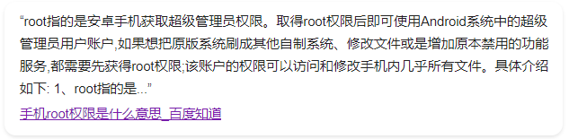

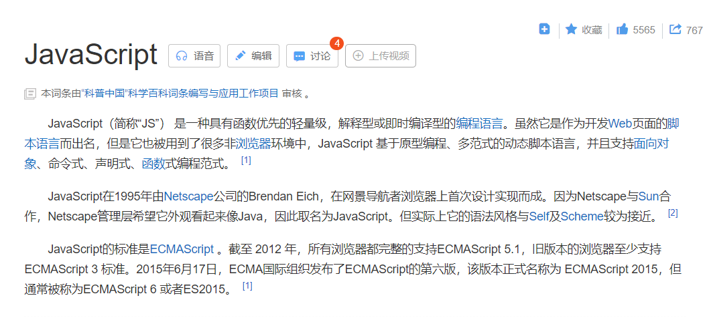


## 2. 环境准备

**劝退警告**：最好是需要有电脑，不然不建议你学习这个东西，因为测试起来会很麻烦


### 1. 手机环境

> 下载地址：https://xuanxiaoqian.lanzoui.com/ivsZ7vny4wj

电脑解压下来是这个样子

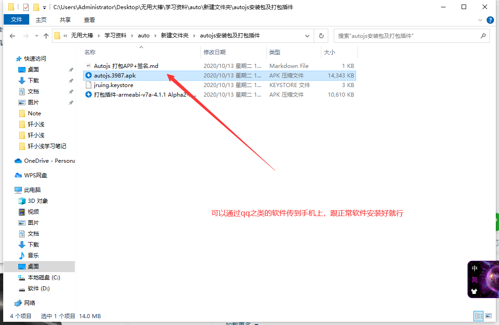

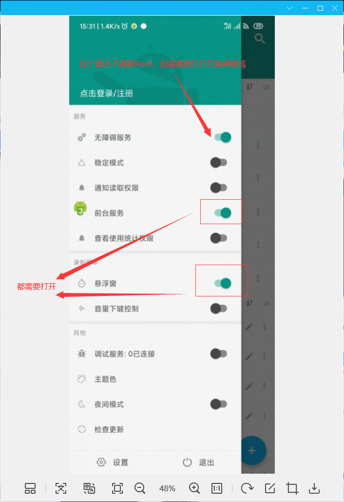

自此手机环境就准备好了


### 2. 电脑软件

> 下载地址：https://code.visualstudio.com/

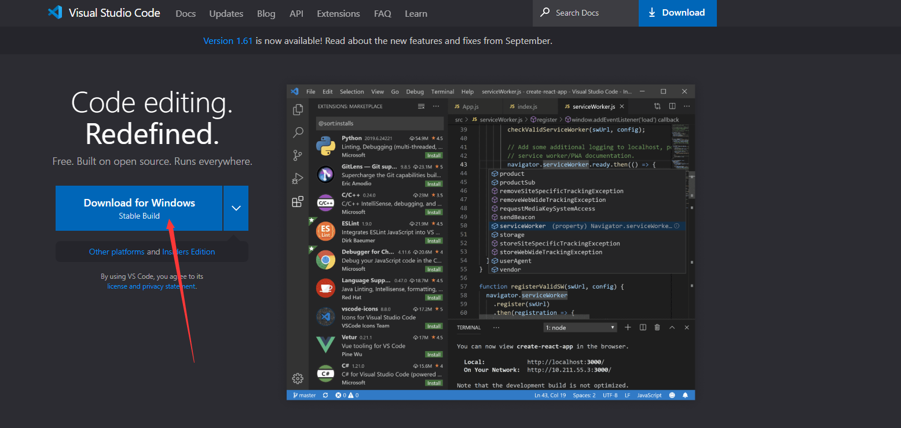

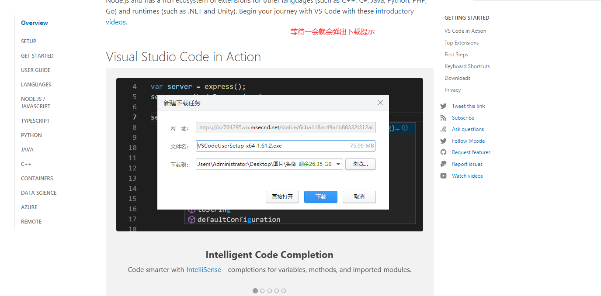


打开软件配置插件

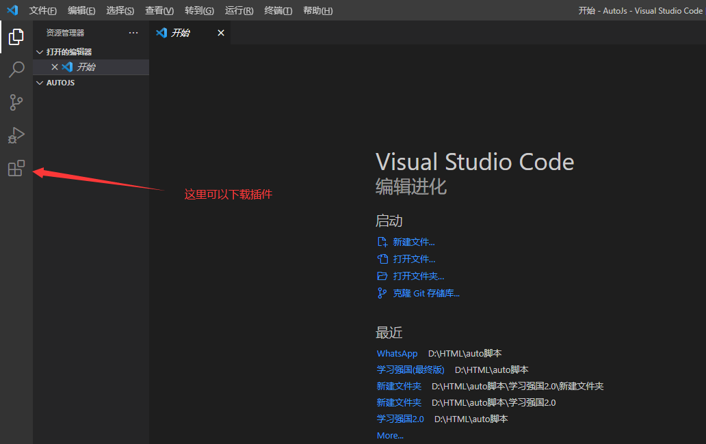

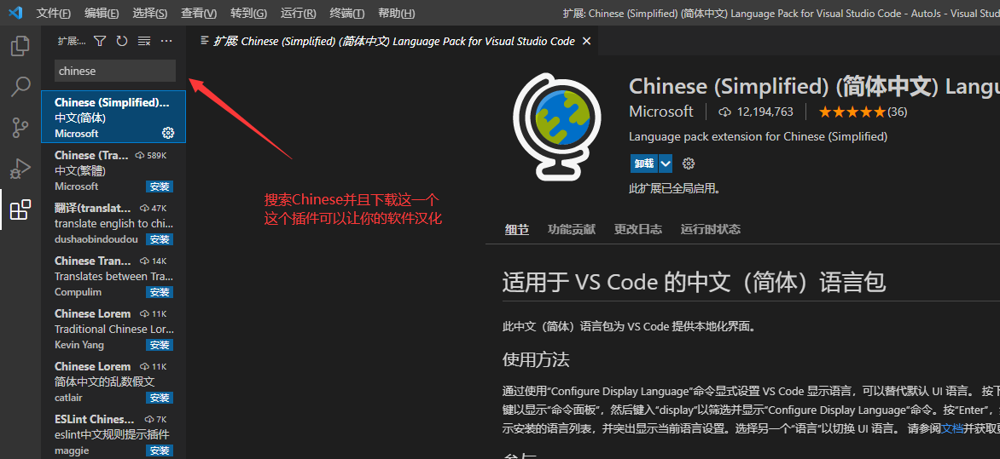

下载这个需要重启软件才能生效

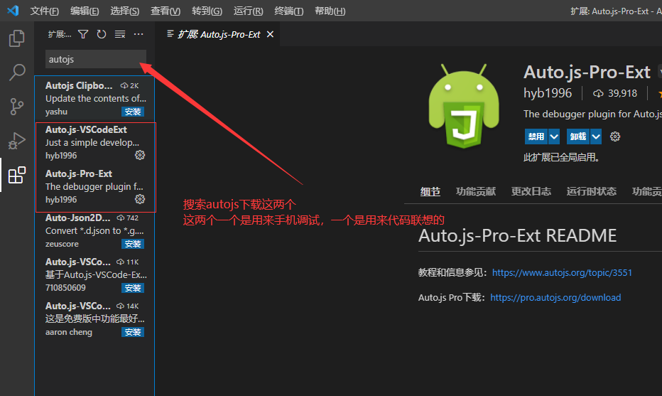


### 3. 测试环境

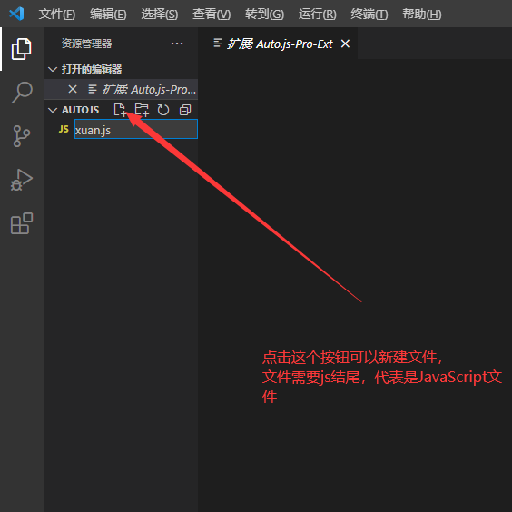

手机需要和电脑在同一个局域网内，通俗来讲就是手机需要连接电脑WIFI。


手机打开调试服务

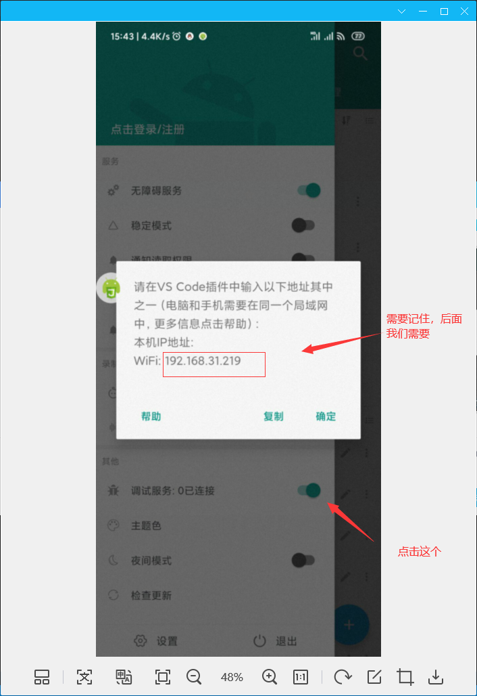


电脑在VSCode软件内按住CTRL + SHIFT + P

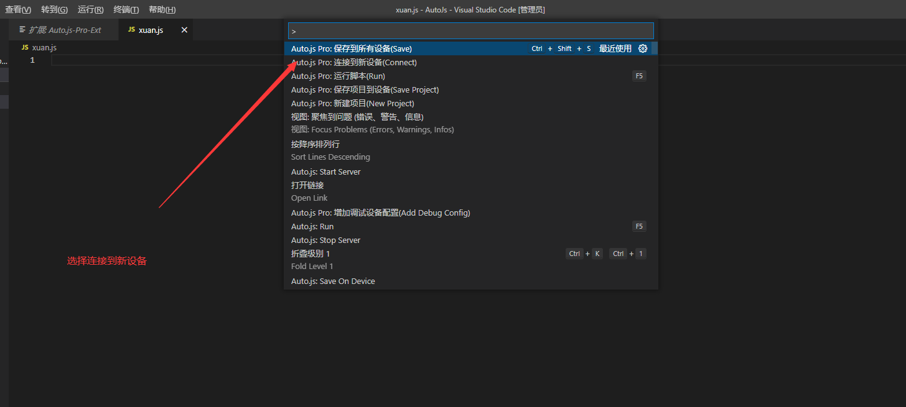

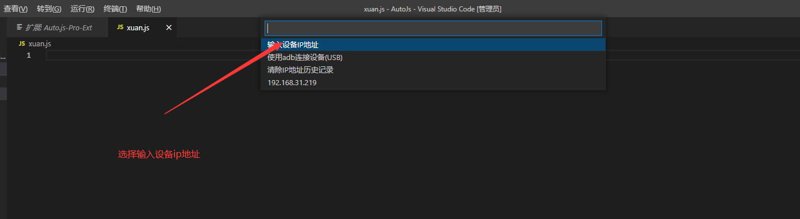

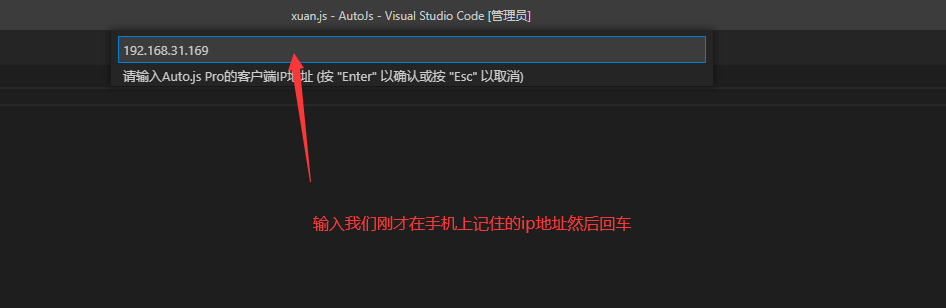

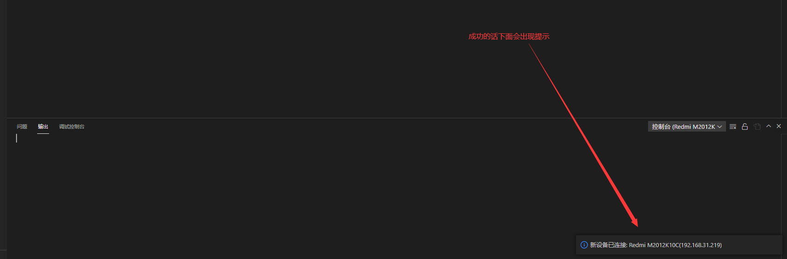

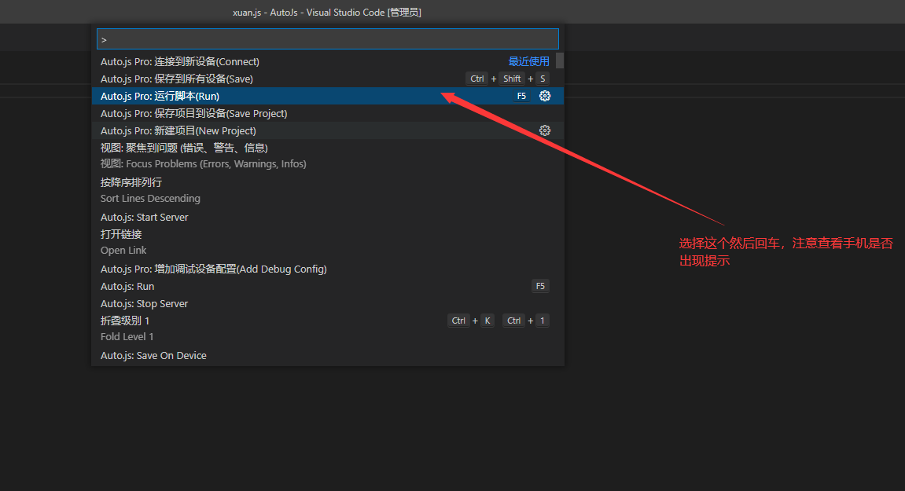

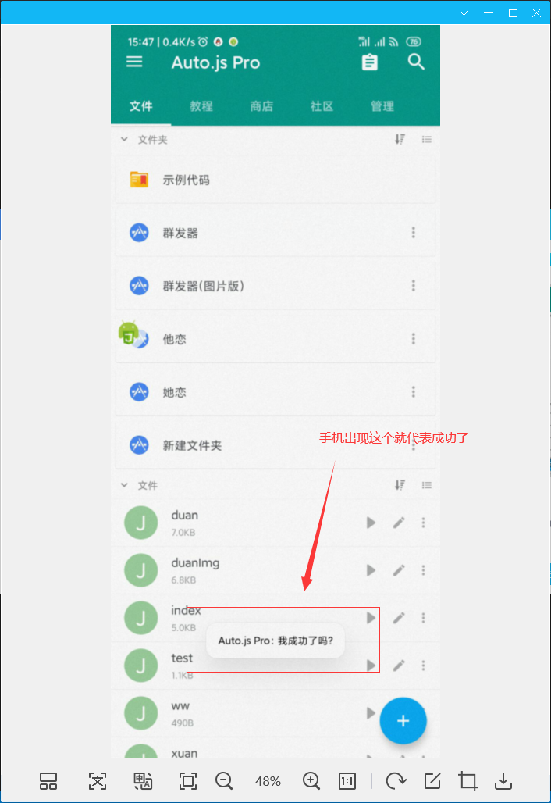


## 3. AutoJs > API

> 有时候在高版本系统调试会出bug建议到光速虚拟机里面进行调试和开发

### 1. 全局函数

```javascript
console.show()	//打开控制台
app.launchApp("QQ");	// 打开指定软件
app.launchPackage("com.xxx")	// 打开指定包名软件
back()	// 返回键
sleep(1000)		//延迟一秒再运行
```


### 2. 常用函数

```javascript
uiobject为组件对象

while (!text("搜索").exists()) { }	// 如果指定文字组件不存在则一直循环
while (!uiobject.exists()) { }	//如果指定组件不存在则一直循环
swipe(550, 1500, 200, 1500, 50)	// 左滑
swipe(550, 1500, 550, 1300, 500)	// 下滑 
click(id("x").findOne().bounds().centerX(),
      id("x").....centerY())	//当出现不可点击控件

id("xxx").findOne().click()	// 点击id为xxx的组件
id("ft6").find().size()	// 这个一般用于查找列表控件
click("xxx")	// 点击组件的text为xxx的组件，不需要组件的clickable为true
setText("断悦");	//往文本框输入内容

log("轩小浅")	//控制台输出轩小浅，字体为白色
console.info('xuanxiaoqian')	//控制台输出轩小浅，字体为白色
console.error('xuanxiaoqian')	//控制台输出轩小浅，字体为红色

uiobject.findOne().children()	//找到指定控件的子控件 | 可能有多个
uiobject.findOne().parent()		//找到指定控件的父控件
uiobject.findOne().child(x)		//找到指定控件的子控件 | 指定为第几个
textStartsWith('x').exists()	//是否存在x开头的文字控件
textContains("x").exists()	//是否存在包含x的文字控件
```


### 3. 数据库

> 数据库使用的是SQLite,在Android高版本是调试不了的，需要打包后才能在高版本使用
>
> 需要下载一个手机虚拟机调试	https://www.gsxnj.cn/index

```javascript
function tikuNet_init(){	//	创建数据库
    sqlite.open("./xuan.db", {version: 1}, {
        onOpen: function(db) {
           db.execSQL(" CREATE TABLE IF NOT EXISTS tikuNet(\
            question CHAR(253),\
            answer CHAR(100)\
            );");
        }
    });
}

function DBIQ(question, answer) {		//往数据库插入数据
    var db = sqlite.open("./xuan.db")

    db.insert("xuan", {
        question: question,
        answer: answer,
    });

    console.info("插入成功")

}

function DBSQ(value) {		//往数据库搜索数据
    var db = sqlite.open("./xuan.db")

    sql = "SELECT answer FROM tiku WHERE question LIKE '" + value + "%'"
    var cursor = db.rawQuery(sql, null);

    if (cursor.moveToFirst()) {
        var answer = cursor.getString(0);
        cursor.close();
        return answer;
    }
    else {
        cursor.close();
        return false;
    }
}


// 本地储存
var storage = storages.create("屏蔽的微信用户");
var arr = ["微信团队","轩小浅"]
storage.put("arr", arr);
log(storage.get("arr").length)
storage.clear()	// 清空
```


### 4. 权限

~~~javascript
floaty.checkPermission()	// 判断是否有悬浮窗权限
auto.service	//判断是否有无障碍权限
engines.stopAll();	// 退出所有脚本

app.startActivity({	//跳转到打开无障碍模式界面
	action: "android.settings.ACCESSIBILITY_SETTINGS"
});

var pkg = app.getPackageName(应用名);	//权限
app.startActivity({
  packageName: "com.android.settings",
  className: "com.android.settings.Settings$AppDrawOverlaySettingsActivity",
  data: "package:" + context.getPackageName(),
});

~~~


### 5. UI

~~~JavaScript
"ui";	// 需要写在文件最开头

ui.layout(
    <vertical>
        
        <text text="轩小浅 内测2.0" textColor="#8A2BE2" gravity="center_horizontal" w="*" textSize="20sp"/>
        <text text="" textColor="red" gravity="center_horizontal" w="*" id="quanxian" textSize="10sp"/>
        <button text="打开无障碍模式" id="AccessOk"/>
        <button text="彩蛋" id="xuan"/>
        <button text="哈哈" id="study"/>
    </vertical>
);

//彩蛋
ui.xuan.click(()=>{
    ui.quanxian.setText("你就是一个很菜的笨蛋");
})

// 跳转到无障碍权限开启页面
ui.AccessOk.click(()=>{
        app.startActivity({
            action: "android.settings.ACCESSIBILITY_SETTINGS"
        });
})


var w = floaty.window(	// 悬浮窗
	<frame gravity="center">
    	<vertical bg="#FFFFFF">
        	<button text="暂停脚本" id="stp" h="200px" />
            <button text="开始脚本" id="sta" h="200px" />
            <button text="退出脚本" id="XClose" h="200px" />
         </vertical>
     </frame>
);

	let ww = device.width;	//得到手机屏幕宽
	let hh = device.height;	//得到手机屏幕高
	w.setSize(250, 800);	//设置悬浮窗宽高
	w.setPosition(0, (hh - 1000))	// 设置悬浮窗显示的位置
ui.run(function () {
     w.XClose.click(() => {    //退出脚本
     	w.close();
        console.hide()

        engines.stopAll();	//退出所有脚本
    })

    w.stp.click(() => {       //暂停脚本
        IFSuspend = false;	// 条件暂停

        log('脚本暂停,先循环完这一次')
    })

    w.sta.click(() => {   //重新开始脚本
        log('脚本开始')
        threads.start(function () {
        IFSuspend = true;

        log("继续运行")
    	})
	})
});

setInterval(() => { }, 1000);	// 需要定义一个空函数来保持悬浮窗运行


<scroll>	//选择框
	<horizontal>
		<Switch id="SendVideo" text="是否需要发送视频" checked="false" textColor="red" padding="8 8 8 8" textSize="10sp" />
	</horizontal>
</scroll>
~~~

```javascript
    confirm("确定吗?等下再添加会很累哦，三思而后行").then(value=>{
        if(value){

        }else{
            log("取消")
        }
    });

    rawInput("请输入您的名字", "小明").then(name => {
        if(name !== null){
            alert("您的名字是" + name);

        }else{

        }

    });
```

