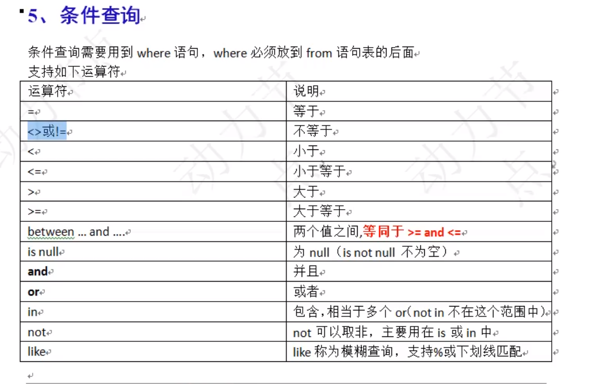
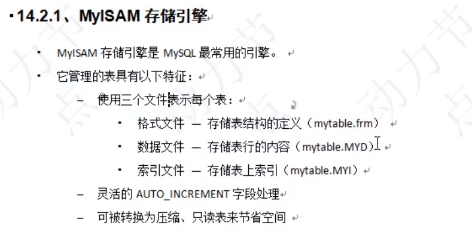
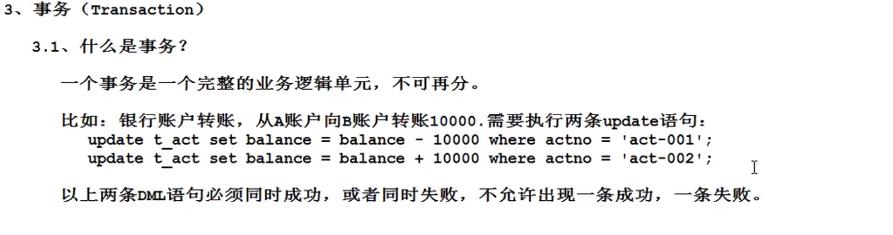
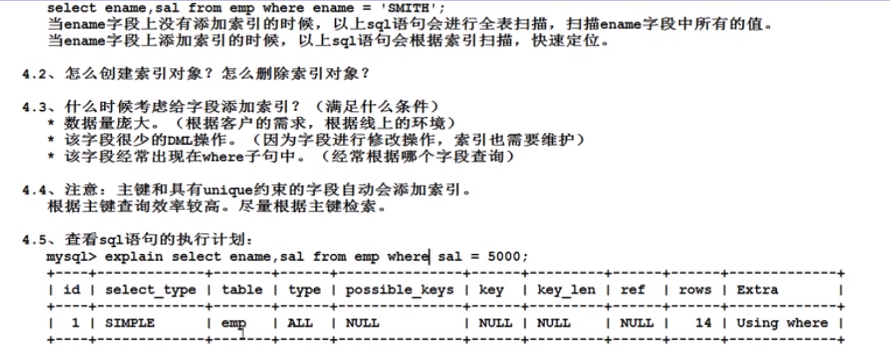

# MySQL

## 1、安装MySQL

> 我建议初学者使用'AppServ'的PHP服务器自带MySQL，原因：方便

## 2、初始化表

~~~sql
-- 部门表	dept
+--------+------------+----------+
| DEPTNO | DNAME      | LOC      |
+--------+------------+----------+
|     10 | ACCOUNTING | NEW YORK |
|     20 | RESEARCH   | DALLAS   |
|     30 | SALES      | CHICAGO  |
|     40 | OPERATIONS | BOSTON   |
+--------+------------+----------+
~~~

~~~sql
-- 员工表	emp
+-------+--------+-----------+------+------------+---------+---------+--------+
| EMPNO | ENAME  | JOB       | MGR  | HIREDATE   | SAL     | COMM    | DEPTNO |
+-------+--------+-----------+------+------------+---------+---------+--------+
|  7369 | SMITH  | CLERK     | 7902 | 1980-12-17 |  800.00 |    NULL |     20 |
|  7499 | ALLEN  | SALESMAN  | 7698 | 1981-02-20 | 1600.00 |  300.00 |     30 |
|  7521 | WARD   | SALESMAN  | 7698 | 1981-02-22 | 1250.00 |  500.00 |     30 |
|  7566 | JONES  | MANAGER   | 7839 | 1981-04-02 | 2975.00 |    NULL |     20 |
|  7654 | MARTIN | SALESMAN  | 7698 | 1981-09-28 | 1250.00 | 1400.00 |     30 |
|  7698 | BLAKE  | MANAGER   | 7839 | 1981-05-01 | 2850.00 |    NULL |     30 |
|  7782 | CLARK  | MANAGER   | 7839 | 1981-06-09 | 2450.00 |    NULL |     10 |
|  7788 | SCOTT  | ANALYST   | 7566 | 1987-04-19 | 3000.00 |    NULL |     20 |
|  7839 | KING   | PRESIDENT | NULL | 1981-11-17 | 5000.00 |    NULL |     10 |
|  7844 | TURNER | SALESMAN  | 7698 | 1981-09-08 | 1500.00 |    0.00 |     30 |
|  7876 | ADAMS  | CLERK     | 7788 | 1987-05-23 | 1100.00 |    NULL |     20 |
|  7900 | JAMES  | CLERK     | 7698 | 1981-12-03 |  950.00 |    NULL |     30 |
|  7902 | FORD   | ANALYST   | 7566 | 1981-12-03 | 3000.00 |    NULL |     20 |
|  7934 | MILLER | CLERK     | 7782 | 1982-01-23 | 1300.00 |    NULL |     10 |
+-------+--------+-----------+------+------------+---------+---------+--------+
~~~

~~~sql
-- 薪资等级表	salgrade	
+-------+-------+-------+
| GRADE | LOSAL | HISAL |
+-------+-------+-------+
|     1 |   700 |  1200 |
|     2 |  1201 |  1400 |
|     3 |  1401 |  2000 |
|     4 |  2001 |  3000 |
|     5 |  3001 |  9999 |
+-------+-------+-------+
~~~

## 2、系统命令

### 2.1、登录MySQL

~~~sql
mysql -uroot -p123456	--登录MySQL

mysql>
~~~

### 2.2、查看所有的库

~~~sql
mysql> show databases;	--查看所有的库
+--------------------+
| Database           |
+--------------------+
| information_schema |
| mysql              |
| mysql_01           |
| phpmyadmin         |
+--------------------+
4 rows in set (0.00 sec)

mysql>
~~~

### 2.3、选择库

~~~sql
mysql> use mysql_01;	--选择指定的库
Database changed
mysql>
~~~

### 2.4、导入sql文件

~~~sql
mysql> source 'sql后缀的路径'	--导入指定的sql文件
Query OK, 0 rows affected, 1 warning (0.00 sec)

Query OK, 0 rows affected, 1 warning (0.00 sec)

Query OK, 0 rows affected, 1 warning (0.00 sec)

Query OK, 0 rows affected (0.01 sec)

Query OK, 0 rows affected (0.01 sec)

mysql>
~~~

### 2.5、查看表数量

~~~sql
mysql> use mysql_01;	--选择指定的库
Database changed

mysql>show tables;		--查看表数量
+--------------------+
| Tables_in_mysql_01 |
+--------------------+
| dept               |
| emp                |
| salgrade           |
+--------------------+
3 rows in set (0.00 sec)

mysql>
~~~

### 2.6、查看表结构

~~~sql
mysql> desc dept;	--选择指定的表查看结构
+--------+-------------+------+-----+---------+-------+
| Field  | Type        | Null | Key | Default | Extra |
+--------+-------------+------+-----+---------+-------+
| DEPTNO | int(2)      | NO   | PRI |         |       |
| DNAME  | varchar(14) | YES  |     | NULL    |       |
| LOC    | varchar(13) | YES  |     | NULL    |       |
+--------+-------------+------+-----+---------+-------+
3 rows in set (0.00 sec)

mysql>
~~~

## 3、基础语法

### 3.1、查询

~~~sql
select * from emp;	--查询‘emp'表内所有的数据
~~~

~~~sql
select ename, eage from emp; --查询表内指定字段
~~~

~~~sql
select * from emp where ename ='轩小浅';
--查询表内名字为’轩小浅‘的所有数据
~~~

~~~sql
select * from emp where sal between 1100 and 3000;
--查询sal 1100到3000之间
~~~

~~~sql
select * from emp where sal> 1100 and sal<3000;
--查询sal 1100到3000之间
~~~

> or -> 或者			in->在里面
>
> where job = '123' or job = '321';		等价于	
>
> where job in('123','321');

### 3.2、模糊查询like

~~~sql
select ename from emp where ename like '%0%';
-- 找出名字包含o的名字

select ename from emp where ename like '_A%';
-- 找出名字第二个字母是A的名字
~~~

### 3.3、升序降序

~~~sql
select ename,sal from emp order by sal;	--默认是升序

select ename,sal from emp order by sal desc;
asc --升序	
desc --降序
~~~

~~~sql
-- 按照工作的降序排列，当工资相同的时候再按照名字的升序排列。
select ename,sal from emp order by sal desc,ename asc;
~~~

###	3.4、分组函数

> 注意，分组函数是在group by分组之后才能使用，所以分组函数不能写在where后面第一列。如果不写group by则默认以整张表为一组

| 函数  | 解释       |
| ----- | ---------- |
| count | 取得记录数 |
| sum   | 求和       |
| avg   | 取平均数   |
| max   | 取最大数   |
| min   | 去最小数   |

~~~sql
select sum(sal) from emp;	--找出工资总和。
select max(sal) from emp;	--找出最高工资。
select avg(sal) from emp;	--找出平均工资。
select min(sal) from emp;	--找出最小工资。
select count(*) from emp;	--找出总人数。
~~~

>分组函数自动忽略NULL

~~~sql
-- 计算每个员工的年薪
select ename,(sal+comm)*12 as yearsal from emp;
-- 输出结果会出现NULL字样，因为MySQL规定 (数组 ？ null) 不论进行什么数学运算最后都会变成null
ifnull()	-- 空处理函数

select ename,(sal+ifnull(comm,0))*12 as yearsal from emp;
~~~

### 3.5、group by和having

> group by:按照某个字段或者某些字段进行分组。
>
> group是将字段里面有相同的数据进行合并分组
>
> 
>
> having:是对分组之后的数据进行再次过滤
>
> ==案例:找出每个工作岗位的最高薪资==

~~~sql
select ename,sal from emp where sal >(select avg(sal) from emp);
~~~

~~~sql
 select job,avg(sal) from emp group by job;
 -- 根据job分组求出工作岗位的平均值
 
  select job,ename ,avg(sal) from emp group by job;
  -- 以上不会MySQL报错 但是Oracle会报错，Oracle十分严谨，以为以上的ename顺序毫无意义
~~~

~~~sql
-- 找出每个部门不同工作岗位的最高薪资

mysql> select deptno,job,max(sal) from emp group by deptno,job;
+--------+-----------+----------+
| deptno | job       | max(sal) |
+--------+-----------+----------+
|     10 | CLERK     |  1300.00 |
|     10 | MANAGER   |  2450.00 |
|     10 | PRESIDENT |  5000.00 |
|     20 | ANALYST   |  3000.00 |
|     20 | CLERK     |  1100.00 |
|     20 | MANAGER   |  2975.00 |
|     30 | CLERK     |   950.00 |
|     30 | MANAGER   |  2850.00 |
|     30 | SALESMAN  |  1600.00 |
+--------+-----------+----------+
9 rows in set (0.00 sec)
~~~

~~~sql
-- 找出每个部门最高薪资，要求显示薪资大于2900的数据
mysql> select deptno,max(sal) from emp group by deptno;
+--------+----------+
| deptno | max(sal) |
+--------+----------+
|     10 |  5000.00 |
|     20 |  3000.00 |
|     30 |  2850.00 |
+--------+----------+
3 rows in set (0.00 sec)

mysql> select deptno,max(sal) from emp group by deptno having max(sal) >2900;
+--------+----------+
| deptno | max(sal) |
+--------+----------+
|     10 |  5000.00 |
|     20 |  3000.00 |
+--------+----------+
2 rows in set (0.00 sec)

mysql>	-- 这种方式效率低下,因为好不容易分组出来2850，但是你又不要了

mysql> select deptno,max(sal) from emp where sal >2900 group by deptno;
+--------+----------+
| deptno | max(sal) |
+--------+----------+
|     10 |  5000.00 |
|     20 |  3000.00 |
+--------+----------+
2 rows in set (0.00 sec)

mysql>
~~~

### 3.6、DQL总结

~~~sql
-- SQL运行顺序
select 			5
	...
from			1
	...
where			2
	...
group by		3
	...
having			4
	...
order by		6
	...
~~~

## 4、中级语法

### 4.1、去重distinct

~~~sql
mysql> select distinct job from emp;
+-----------+
| job       |
+-----------+
| CLERK     |
| SALESMAN  |
| MANAGER   |
| ANALYST   |
| PRESIDENT |
+-----------+
5 rows in set (0.00 sec)

mysql>select ename,distinct job from emp;
-- 以上sql语句是错误的。
-- 记住：distinct只能出现在所有字段的最前面。
~~~

### 4.2、连接查询

~~~sql
mysql> select ename,dname from emp,dept;
+--------+------------+
| ename  | dname      |
+--------+------------+
| SMITH  | ACCOUNTING |
| SMITH  | RESEARCH   |
| SMITH  | SALES      |
| SMITH  | OPERATIONS |
| ALLEN  | ACCOUNTING |
| ALLEN  | RESEARCH   |
| ALLEN  | SALES      |
| ALLEN  | OPERATIONS |
| WARD   | ACCOUNTING |
| WARD   | RESEARCH   |
| WARD   | SALES      |
| WARD   | OPERATIONS |
| JONES  | ACCOUNTING |
| JONES  | RESEARCH   |
| JONES  | SALES      |
| JONES  | OPERATIONS |
| MARTIN | ACCOUNTING |
| MARTIN | RESEARCH   |
| MARTIN | SALES      |
| MARTIN | OPERATIONS |
| BLAKE  | ACCOUNTING |
| BLAKE  | RESEARCH   |
| BLAKE  | SALES      |
| BLAKE  | OPERATIONS |
| CLARK  | ACCOUNTING |
| CLARK  | RESEARCH   |
| CLARK  | SALES      |
| CLARK  | OPERATIONS |
| SCOTT  | ACCOUNTING |
| SCOTT  | RESEARCH   |
| SCOTT  | SALES      |
| SCOTT  | OPERATIONS |
| KING   | ACCOUNTING |
| KING   | RESEARCH   |
| KING   | SALES      |
| KING   | OPERATIONS |
| TURNER | ACCOUNTING |
| TURNER | RESEARCH   |
| TURNER | SALES      |
| TURNER | OPERATIONS |
| ADAMS  | ACCOUNTING |
| ADAMS  | RESEARCH   |
| ADAMS  | SALES      |
| ADAMS  | OPERATIONS |
| JAMES  | ACCOUNTING |
| JAMES  | RESEARCH   |
| JAMES  | SALES      |
| JAMES  | OPERATIONS |
| FORD   | ACCOUNTING |
| FORD   | RESEARCH   |
| FORD   | SALES      |
| FORD   | OPERATIONS |
| MILLER | ACCOUNTING |
| MILLER | RESEARCH   |
| MILLER | SALES      |
| MILLER | OPERATIONS |
+--------+------------+
56 rows in set (0.00 sec)

mysql>	--笛卡尔积现象
~~~

> ​	给两张表分别起别名能让执行效率变高，因为MySQL在from后面的表都会寻找select的字段，因为MySQL不知道字段是哪个表的，但是起了别名就让MySQL知道在哪个表。

~~~sql
-- 避免笛卡尔积现象
mysql> select e.ename,d.dname from emp e,dept d
where e.deptno = d.deptno;
+--------+------------+
| ename  | dname      |
+--------+------------+
| CLARK  | ACCOUNTING |
| KING   | ACCOUNTING |
| MILLER | ACCOUNTING |
| SMITH  | RESEARCH   |
| JONES  | RESEARCH   |
| SCOTT  | RESEARCH   |
| ADAMS  | RESEARCH   |
| FORD   | RESEARCH   |
| ALLEN  | SALES      |
| WARD   | SALES      |
| MARTIN | SALES      |
| BLAKE  | SALES      |
| TURNER | SALES      |
| JAMES  | SALES      |
+--------+------------+
14 rows in set (0.00 sec)

mysql>
~~~

~~~sql
-- SQL92：（太老，不用了）
select 
	e.ename,d.dname 
from 
	emp e,dept d
where 
	e.deptno = d.deptno;

-- SQL99：（常用）
select 
	e.ename,d.dname 
from 
	emp e 
join -- 可以写成 inner join	但是inner可以省略不写
	dept d
on 
	e.deptno = d.deptno;
~~~

### 4.3、非等值连接

~~~sql
-- 案例:找出每个员工的工资等级，要求显示员工名,工资,工资等级
select e.ename,e.sal,s.grade from emp e,salgrade s where e.sal >= s.losal and e.sal<=s.HISAL;

-- between
select e.ename,e.sal,s.grade from emp e,salgrade s where e.sal between s.losal and s.HISAL;

-- SQL99
select 
	e.ename,e.sal,s.grade 
from 
	emp e 
join 
	salgrade s 
on 
	e.sal between s.losal and s.HISAL;
~~~

### 4.4、自连接

~~~sql
-- 找出每个员工的上级领导，要求显示员工名和对应的领导名
select 
	e.ename,w.ename 
from 
	emp e 
join 
	emp w
on
	e.mgr = w.empno;
+--------+-------+
| ename  | ename |
+--------+-------+
| SMITH  | FORD  |
| ALLEN  | BLAKE |
| WARD   | BLAKE |
| JONES  | KING  |
| MARTIN | BLAKE |
| BLAKE  | KING  |
| CLARK  | KING  |
| SCOTT  | JONES |
| TURNER | BLAKE |
| ADAMS  | SCOTT |
| JAMES  | BLAKE |
| FORD   | JONES |
| MILLER | CLARK |
+--------+-------+
13 rows in set (0.03 sec)

mysql> 	
~~~

### 4.5、外连接

~~~sql
-- 找出每个员工的上级领导，要求显示员工名和对应的领导名
select 
	e.ename,w.ename 
from 
	emp e 
left join -- 可写成left outer join | 'outer'可省略不写
	emp w
on
	e.mgr = w.empno;
+--------+-------+
| ename  | ename |
+--------+-------+
| SMITH  | FORD  |
| ALLEN  | BLAKE |
| WARD   | BLAKE |
| JONES  | KING  |
| MARTIN | BLAKE |
| BLAKE  | KING  |
| CLARK  | KING  |
| SCOTT  | JONES |
| KING   | NULL  |
| TURNER | BLAKE |
| ADAMS  | SCOTT |
| JAMES  | BLAKE |
| FORD   | JONES |
| MILLER | CLARK |
+--------+-------+
14 rows in set (0.03 sec)

mysql> 	-- 14条记录，当匹配不上时会自动匹配为NULL,因为左表e为主表一定要查询出来
~~~

### 4.6、多表连接

~~~sql
-- 找出没一个员工的部门名称以及工资等级
select
	e.ename,d.dname,s.grade
from
	emp e
join
	dept d
on 
	e.deptno = d.deptno
join
	salgrade s
on
	e.sal between s.losal and s.hisal;
	
+--------+------------+-------+
| ename  | dname      | grade |
+--------+------------+-------+
| SMITH  | RESEARCH   |     1 |
| ALLEN  | SALES      |     3 |
| WARD   | SALES      |     2 |
| JONES  | RESEARCH   |     4 |
| MARTIN | SALES      |     2 |
| BLAKE  | SALES      |     4 |
| CLARK  | ACCOUNTING |     4 |
| SCOTT  | RESEARCH   |     4 |
| KING   | ACCOUNTING |     5 |
| TURNER | SALES      |     3 |
| ADAMS  | RESEARCH   |     1 |
| JAMES  | SALES      |     1 |
| FORD   | RESEARCH   |     4 |
| MILLER | ACCOUNTING |     2 |
+--------+------------+-------+
14 rows in set (0.00 sec)

mysql>
~~~

~~~sql
-- 案例:找出每一个员工的部门名称、工资等级、上级领导

--首先找出员工名称和部门名称
select 	
	e.ename,d.dname
from 
	emp e 
join
	dept d
on
	e.deptno = d.deptno;
+--------+------------+
| ename  | dname      |
+--------+------------+
| CLARK  | ACCOUNTING |
| KING   | ACCOUNTING |
| MILLER | ACCOUNTING |
| SMITH  | RESEARCH   |
| JONES  | RESEARCH   |
| SCOTT  | RESEARCH   |
| ADAMS  | RESEARCH   |
| FORD   | RESEARCH   |
| ALLEN  | SALES      |
| WARD   | SALES      |
| MARTIN | SALES      |
| BLAKE  | SALES      |
| TURNER | SALES      |
| JAMES  | SALES      |
+--------+------------+
14 rows in set (0.07 sec)

mysql> 

-- 其次找出工资等级
select 	
	e.ename,d.dname,s.grade
from 
	emp e 
join
	dept d
on
	e.deptno = d.deptno
join
	salgrade s
on 
	e.sal between s.losal and s.hisal;
+--------+------------+-------+
| ename  | dname      | grade |
+--------+------------+-------+
| SMITH  | RESEARCH   |     1 |
| ALLEN  | SALES      |     3 |
| WARD   | SALES      |     2 |
| JONES  | RESEARCH   |     4 |
| MARTIN | SALES      |     2 |
| BLAKE  | SALES      |     4 |
| CLARK  | ACCOUNTING |     4 |
| SCOTT  | RESEARCH   |     4 |
| KING   | ACCOUNTING |     5 |
| TURNER | SALES      |     3 |
| ADAMS  | RESEARCH   |     1 |
| JAMES  | SALES      |     1 |
| FORD   | RESEARCH   |     4 |
| MILLER | ACCOUNTING |     2 |
+--------+------------+-------+
14 rows in set (0.00 sec)

mysql>
	
-- 最后利用自连接找到上级领导
select 	
	e.ename,d.dname,s.grade,w.ename
from 
	emp e 
join
	dept d
on
	e.deptno = d.deptno
join
	salgrade s
on 
	e.sal between s.losal and s.hisal
join
	emp w
on
	e.mgr = w.empno;
+--------+------------+-------+-------+
| ename  | dname      | grade | ename |
+--------+------------+-------+-------+
| SMITH  | RESEARCH   |     1 | FORD  |
| ALLEN  | SALES      |     3 | BLAKE |
| WARD   | SALES      |     2 | BLAKE |
| JONES  | RESEARCH   |     4 | KING  |
| MARTIN | SALES      |     2 | BLAKE |
| BLAKE  | SALES      |     4 | KING  |
| CLARK  | ACCOUNTING |     4 | KING  |
| SCOTT  | RESEARCH   |     4 | JONES |
| TURNER | SALES      |     3 | BLAKE |
| ADAMS  | RESEARCH   |     1 | SCOTT |
| JAMES  | SALES      |     1 | BLAKE |
| FORD   | RESEARCH   |     4 | JONES |
| MILLER | ACCOUNTING |     2 | CLARK |
+--------+------------+-------+-------+
13 rows in set (0.00 sec)

mysql>	-- 注意:这里少了一条是因为用了自连接，所以要利用外连接将少的自动匹配为NULL

select 	
	e.ename,d.dname,s.grade,w.ename
from 
	emp e 
join
	dept d
on
	e.deptno = d.deptno
join
	salgrade s
on 
	e.sal between s.losal and s.hisal
left join
	emp w
on
	e.mgr = w.empno;
+--------+------------+-------+-------+
| ename  | dname      | grade | ename |
+--------+------------+-------+-------+
| SMITH  | RESEARCH   |     1 | FORD  |
| ALLEN  | SALES      |     3 | BLAKE |
| WARD   | SALES      |     2 | BLAKE |
| JONES  | RESEARCH   |     4 | KING  |
| MARTIN | SALES      |     2 | BLAKE |
| BLAKE  | SALES      |     4 | KING  |
| CLARK  | ACCOUNTING |     4 | KING  |
| SCOTT  | RESEARCH   |     4 | JONES |
| KING   | ACCOUNTING |     5 | NULL  |
| TURNER | SALES      |     3 | BLAKE |
| ADAMS  | RESEARCH   |     1 | SCOTT |
| JAMES  | SALES      |     1 | BLAKE |
| FORD   | RESEARCH   |     4 | JONES |
| MILLER | ACCOUNTING |     2 | CLARK |
+--------+------------+-------+-------+
14 rows in set (0.00 sec)

mysql>
~~~

### 4.7、子查询

> ==**什么是子查询？**==
>
> ​	套娃——>select语句中嵌套select语句。

#### 4.7.1、where后面

~~~sql
-- 案例:找出高于平均薪资的员工信息。

-- 第一步：找出平均薪资
select avg(sal) from emp;
+-------------+
| avg(sal)    |
+-------------+
| 2073.214286 |
+-------------+
1 row in set (0.00 sec)

mysql>

-- 第二步：where过滤
select ename,sal from emp where sal > 2073.214286;
+-------+---------+
| ename | sal     |
+-------+---------+
| JONES | 2975.00 |
| BLAKE | 2850.00 |
| CLARK | 2450.00 |
| SCOTT | 3000.00 |
| KING  | 5000.00 |
| FORD  | 3000.00 |
+-------+---------+
6 rows in set (0.00 sec)

mysql>

-- 但是利用子查询我们就可以写成一句
select ename,sal from emp where sal > (select avg(sal) from emp);
+-------+---------+
| ename | sal     |
+-------+---------+
| JONES | 2975.00 |
| BLAKE | 2850.00 |
| CLARK | 2450.00 |
| SCOTT | 3000.00 |
| KING  | 5000.00 |
| FORD  | 3000.00 |
+-------+---------+
6 rows in set (0.00 sec)

mysql>	--	子查询可以解决where后面不能写分组函数等问题
~~~

#### 4.7.2、from后面

~~~sql
-- 找出每个部门平均薪水的薪资等级

-- 第一步：找出每个部门平均薪水
select deptno,avg(sal) as avg from emp group by deptno;
+--------+-------------+
| deptno | avg         |
+--------+-------------+
|     10 | 2916.666667 |
|     20 | 2175.000000 |
|     30 | 1566.666667 |
+--------+-------------+
3 rows in set (0.00 sec)

mysql>

-- 第二步：把查询出来的平均薪水当成一个新的表d
select 
	s.grade,d.avg 
from 
	salgrade s,
	(select deptno,avg(sal) as avg from emp group by deptno) d 
where 
	d.avg between s.losal and s.hisal;
+-------+-------------+
| grade | avg         |
+-------+-------------+
|     3 | 1566.666667 |
|     4 | 2916.666667 |
|     4 | 2175.000000 |
+-------+-------------+
3 rows in set (0.05 sec)

mysql> 

-- SQL99
select 
	s.grade,d.avg 
from 
	salgrade s
join
	(select deptno,avg(sal) as avg from emp group by deptno) d 
on
	d.avg between s.losal and s.hisal;
+-------+-------------+
| grade | avg         |
+-------+-------------+
|     3 | 1566.666667 |
|     4 | 2916.666667 |
|     4 | 2175.000000 |
+-------+-------------+
3 rows in set (0.05 sec)

mysql> 
~~~

### 4.8、union

> 可以将查询结果集相加

~~~sql
-- 找出工作岗位是SALESMAN和MANAGER的员工

-- 第一种:
select ename,job from emp where job = 'MANAGER' or job = 'SALESMAN';

-- 第二种:
select ename,job from emp where job in('MANAGER','SALESMAN');

-- 第三种:
select ename,job from emp where job = 'MANAGER' 
union
select ename,job from emp where job = 'SALESMAN';
+--------+----------+
| ename  | job      |
+--------+----------+
| JONES  | MANAGER  |
| BLAKE  | MANAGER  |
| CLARK  | MANAGER  |
| ALLEN  | SALESMAN |
| WARD   | SALESMAN |
| MARTIN | SALESMAN |
| TURNER | SALESMAN |
+--------+----------+
7 rows in set (0.00 sec)

mysql>
~~~

### 4.9、分页

#### 4.9.1、limit

> ==**limit是MySQL独有的。limit取结果集中的部分数据**==

~~~sql
-- 取出工资前5名的员工
select ename,sal from emp order by sal desc limit 0,5;
+-------+---------+
| ename | sal     |
+-------+---------+
| KING  | 5000.00 |
| SCOTT | 3000.00 |
| FORD  | 3000.00 |
| JONES | 2975.00 |
| BLAKE | 2850.00 |
+-------+---------+
5 rows in set (0.00 sec)

mysql>	-- 不写下标默认从零开始

select ename,sal from emp order by sal desc limit 5;
~~~

## 5、高级语法

### 5.1、表的创建

~~~sql
create table 表名(
	字段名1 数据类型,
    字段名2 数据类型,
    字段名3 数据类型,
    ...
);
~~~

### 5.2、插入数据

~~~sql
insert into user(id,username,password) values(1,'轩小浅','123456');
~~~

### 5.3、修改数据

~~~sql
updata user set id = '2',username = '断悦' where id = '1';
~~~

### 5.4、删除数据

~~~sql
delete from user where id = '1';
~~~

~~~sql
-- 删除所有数据
delete from user;
~~~

~~~sql
-- 删除表	——> 删除不可恢复	表被截断，不可回滚。永久丢失
truncate table user;
~~~

~~~sql
-- 完全删除表，删除表结构
drop table user;

-- 出现这个错误 代表该表外键关联了数据或者表
-- 1217 - Cannot delete or update a parent row: a foreign key constraint fails

-- 解决方法
SET foreign_key_checks = 0;  -- 先设置外键约束检查关闭
 
drop table mytable;  -- 删除数据，表或者视图
 
SET foreign_key_checks = 1; -- 开启外键约束检查，以保持表结构完整性

~~~

### 5.5、非空约束 not null

~~~sql
-- 如果存在表就删除表
drop table if exists t_user;

-- 然后创建表并设置约束
create table t_user(
	id int,
    username varchar(255) not null,
    password varchar(255)
);
~~~

### 5.6、唯一性约束 unique

~~~sql
-- 如果存在表就删除表
drop table if exists t_user;

-- 然后创建表并设置约束
create table t_user(
	id int,
    username varchar(255) unique,
    password varchar(255)
);

-- 设置多个
create table t_user(
	id int,
    username varchar(255) unique,
    password varchar(255) unique
);

-- 表级约束   ——> 设置username和password连起来不能一样
-- username = 1 password = 1s	1
-- username = 1 password = 2s	2
-- username = 2 password = 1s	3
-- username = 1 password = 1s	4
-- 其中1 和 4重复报错，其他都不报错
create table t_user(
	id int,
    username varchar(255),
    password varchar(255)
    unique(username,password2)
);
~~~

### 5.7、主键约束

~~~sql
-- 如果存在表就删除表
drop table if exists t_user;

-- 然后创建表并设置约束
create table t_user(
	id int primary key,
    username varchar(255),
    password varchar(255)
);		
~~~

### 5.8、主键自增

~~~sql
-- 如果存在表就删除表
drop table if exists t_user;

-- 然后创建表并设置约束
create table t_user(
	id int primary key auto_increment,
    username varchar(255),
    password varchar(255)
);		
~~~

### 5.9、外键约束

> 不加外键约束内容可以随便写，但是你如果该字段加了外键约束则需要引用外表相对应的字段约束内容

~~~sql
create table t_class(
	con int,
    cname varchar(255),
    primary key(cno)
);

create table t_student(
	sno int,
    sname varchar(255),
    classno int,
    foreign key(classno) references t_class(cno)
);
~~~

## 6、其他

### 6.1、存储引擎

~~~sql
-- 查看当前版本MySQL支持的引擎
show engines \G
show engines;
+------------+---------+----------------------------------------------------------------+
| Engine     | Support | Comment                                                        |
+------------+---------+----------------------------------------------------------------+
| MyISAM     | DEFAULT | Default engine as of MySQL 3.23 with great performance         |
| MEMORY     | YES     | Hash based, stored in memory, useful for temporary tables      |
| InnoDB     | YES     | Supports transactions, row-level locking, and foreign keys     |
| BerkeleyDB | NO      | Supports transactions and page-level locking                   |
| BLACKHOLE  | YES     | /dev/null storage engine (anything you write to it disappears) |
| EXAMPLE    | NO      | Example storage engine                                         |
| ARCHIVE    | YES     | Archive storage engine                                         |
| CSV        | NO      | CSV storage engine                                             |
| ndbcluster | NO      | Clustered, fault-tolerant, memory-based tables                 |
| FEDERATED  | YES     | Federated MySQL storage engine                                 |
| MRG_MYISAM | YES     | Collection of identical MyISAM tables                          |
| ISAM       | NO      | Obsolete storage engine                                        |
+------------+---------+----------------------------------------------------------------+
12 rows in set (0.00 sec)

mysql>
~~~

### 6.2、事务概述

> 一个事务是一个完整的业务逻辑单元，不可再分

### 6.3、索引

### 6.4、视图

### 6.5、导入导出

### 6.6、数据库设计三范式

> **第一范式是基本要求，即每个列都是不可分割的数据项， 如果连这个都满足不了，还是洗洗睡吧。**
>
> **第二范式要求实体属性要完全依赖主键，不能依赖部分主键。**
>
> **第三范式就是一个表中不能包含其它表中已包含的非主关键字信息。不严谨地说就是这个表只包含其他表的ID。**
>
> **==一般来说，我们都会遵循第一和第二范式， 但是为了性能，为了避免过多的join, 有时候会违反第三范式，冗余一些字段的信息。==**

## 7、小题目

### 7.1

**取得每个部门最高薪水的人员名称**

~~~sql
-- 第一步：求最高薪水
select deptno,max(sal) from emp group by deptno;
+--------+----------+
| deptno | max(sal) |
+--------+----------+
|     10 |  5000.00 |
|     20 |  3000.00 |
|     30 |  2850.00 |
+--------+----------+
3 rows in set (0.05 sec)

mysql>
-- 第二步：将上面查询出来的表当做一张t表
select e.ename,t.* from emp e join (select deptno,max(sal) as maxsal from emp group by deptno) t on t.deptno = e.deptno and t.maxsal = e.sal;
+-------+--------+---------+
| ename | deptno | maxsal  |
+-------+--------+---------+
| BLAKE |     30 | 2850.00 |
| SCOTT |     20 | 3000.00 |
| KING  |     10 | 5000.00 |
| FORD  |     20 | 3000.00 |
+-------+--------+---------+
4 rows in set (0.03 sec)

mysql>
~~~

### 7.2

**哪些人的薪水在部门和平均薪水之上**

~~~sql
-- 第一步：求平均薪水
select deptno,avg(sal) from emp group by deptno;
+--------+-------------+
| deptno | avg(sal)    |
+--------+-------------+
|     10 | 2916.666667 |
|     20 | 2175.000000 |
|     30 | 1566.666667 |
+--------+-------------+
3 rows in set (0.03 sec)

mysql>
-- 第二步：将上面的数据当做单独数据t
select e.ename, e.sal,e.deptno from emp e join (select deptno,avg(sal) as avgsal from emp group by deptno) t on e.deptno = t.deptno and e.sal > t.avgsal order by deptno;
+-------+---------+--------+
| ename | sal     | deptno |
+-------+---------+--------+
| KING  | 5000.00 |     10 |
| FORD  | 3000.00 |     20 |
| JONES | 2975.00 |     20 |
| SCOTT | 3000.00 |     20 |
| ALLEN | 1600.00 |     30 |
| BLAKE | 2850.00 |     30 |
+-------+---------+--------+
6 rows in set (0.05 sec)

mysql> 
~~~

### 7.3

**取得部门中（所有人）平均的薪水等级**

~~~sql
select
	e.deptno,avg(s.grade)
from 
	emp e
join
	salgrade s
on
	e.sal between s.losal and s.hisal
group by
	e.deptno;
+--------+--------------+
| deptno | avg(s.grade) |
+--------+--------------+
|     10 | 3.6667       |
|     20 | 2.8000       |
|     30 | 2.5000       |
+--------+--------------+
3 rows in set (0.05 sec)

mysql> 
~~~

### 7.4

不准用组函数（Max），取得最高薪水（两种方案）

~~~sql
-- 取出所有的薪水
select sal from emp;
+---------+
| sal     |
+---------+
| 5000.00 |
| 3000.00 |
| 3000.00 |
| 2975.00 |
| 2850.00 |
| 2450.00 |
| 1600.00 |
| 1500.00 |
| 1300.00 |
| 1250.00 |
| 1250.00 |
| 1100.00 |
|  950.00 |
|  800.00 |
+---------+
14 rows in set (0.05 sec)

mysql>
-- 1、按薪水大小排 取出第一个
select sal from emp order by sal desc limit 1;
+---------+
| sal     |
+---------+
| 5000.00 |
+---------+
1 row in set (0.04 sec)

mysql> 
-- 2、表的自连接
select sal from emp where sal not in(select 
					distinct a.sal
				from
					emp a
				join
					emp b
				on
					a.sal < b.sal);
~~~

### 7.5

**取得平均薪水最高的部门的部门编号（给出两种）**

~~~sql
-- 取出每个部门的平均薪水
select deptno,avg(sal) avgsal from emp group by deptno;
+--------+-------------+
| deptno | avgsal      |
+--------+-------------+
|     10 | 2916.666667 |
|     20 | 2175.000000 |
|     30 | 1566.666667 |
+--------+-------------+
3 rows in set (0.06 sec)

mysql> 

-- 1、取出第一条
select deptno,avg(sal) avgsal from emp group by deptno limit 1;
+--------+-------------+
| deptno | avgsal      |
+--------+-------------+
|     10 | 2916.666667 |
+--------+-------------+
1 row in set (0.04 sec)

mysql> 

-- 2、
select max(t.avgsal) from (select deptno,avg(sal) avgsal from emp group by deptno) t;
+---------------+
| max(t.avgsal) |
+---------------+
|   2916.666667 |
+---------------+
1 row in set (0.04 sec)

mysql> 
~~~

## 8、大总结

> sql优化 https://www.cnblogs.com/biehongli/p/10194259.html
>
> https://blog.csdn.net/qq_35642036/article/details/82820129

~~~sql
-- 1、尽量避免使用子查询

-- 2、避免函数索引

-- 3、用IN来替换OR

-- 4、LIKE前缀%号、双百分号、_下划线查询非索引列或*无法使用到索引，如果查询的是索引列则可以

-- 5、读取适当的记录LIMIT M,N，而不要读多余的记录
select id,name 
from table_name limit 866613, 20

select id,name from table_name 
where id> 866612 limit 20

-- 6、避免数据类型不一致

-- 7、分组统计可以禁止排序sort，总和查询可以禁止排重用union all

-- 8、避免随机取记录

-- 9、禁止不必要的ORDER BY排序

-- 10、批量INSERT插入应该拼接插入

-- 11、不要使用NOT等负向查询条件

-- 12、尽量不用select *

-- 13、区分in和exists

-- 14、字符串不加单引号索引失效

-- 15、少用or，用它来连接时会索引失效

-- 16、避免在 where 子句中对字段进行 null 值判断

~~~

~~~sql
-- explain可查看sql扫描次数
mysql> explain select * from emp where salary = 55555;
+----+-------------+-------+------+---------------+------+---------+------+--------+-------------+
| id | select_type | table | type | possible_keys | key  | key_len | ref  | rows   | Extra       |
+----+-------------+-------+------+---------------+------+---------+------+--------+-------------+
|  1 | SIMPLE      | emp   | ALL  | NULL          | NULL | NULL    | NULL | 349179 | Using where |
+----+-------------+-------+------+---------------+------+---------+------+--------+-------------+
1 row in set (0.04 sec)

-- 可以看出使用索引查询更快，因为只扫描了一次
mysql> explain select * from emp where id = 349177 limit 1;
+----+-------------+-------+-------+---------------+---------+---------+-------+------+-------+
| id | select_type | table | type  | possible_keys | key     | key_len | ref   | rows | Extra |
+----+-------------+-------+-------+---------------+---------+---------+-------+------+-------+
|  1 | SIMPLE      | emp   | const | PRIMARY       | PRIMARY | 4       | const |    1 |       |
+----+-------------+-------+-------+---------------+---------+---------+-------+------+-------+
1 row in set (0.04 sec)
~~~

