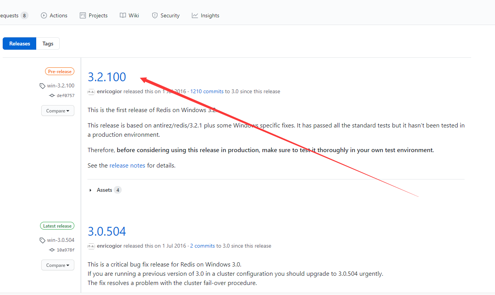
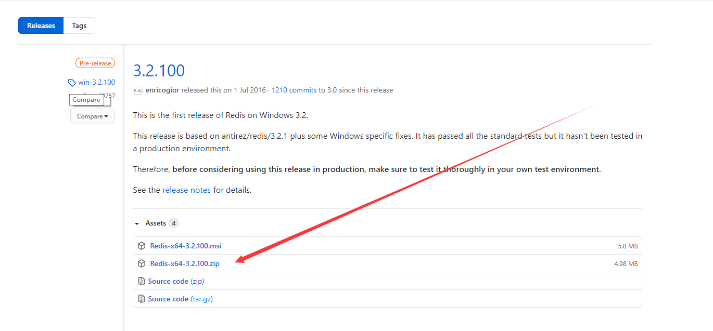
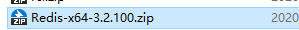
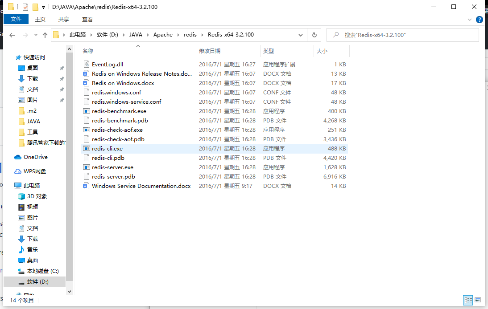
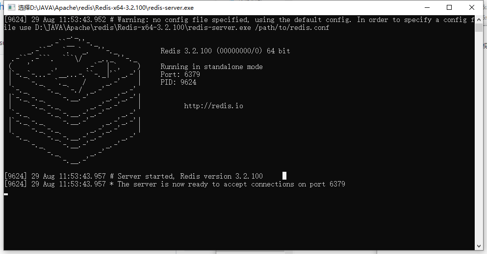
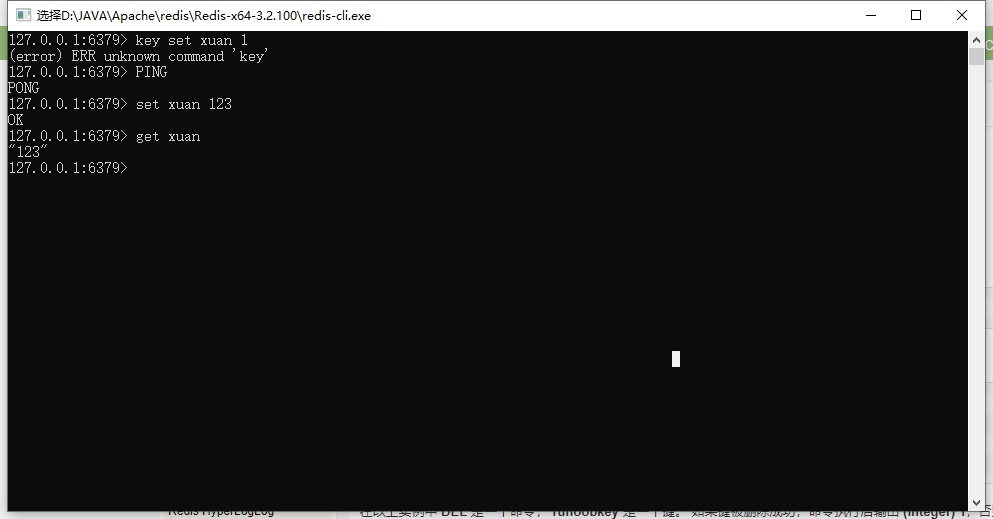

# Redis

## 1.什么是Redis

> 远程字典服务，字典一词在python是K/V键值对存在

- redis是一个key-value[存储系统](https://baike.baidu.com/item/存储系统)。
- 支持string(字符串)、list([链表](https://baike.baidu.com/item/链表))、set(集合)、zset(sorted set --有序集合)和hash（哈希类型）
- 是一个==高性能==的key-value数据库
- 支持主从同步,数据可以从主服务器向任意数量的从服务器上同步

  

## 2.安装Redis

>  github地址: https://github.com/microsoftarchive/redis/releases

解压后目录结构：

双击redis-server.exe ->服务端:

再次双击redis-cli ->客户端:

这样我们的Redis高性能服务器就安装好啦

## 3. Redis基础命令

### 1.公共

~~~bash
keys *	//查看所有的键
~~~

### 2. String

~~~bash
set 　　 // 设置key
get     // 获取key

append  // 追加string

mset    // 设置多个键值对
mget    // 获取多个键值对

del     // 删除key

incr    // 递增+1
decr    // 递减-1
~~~

### 3.List

~~~bash
127.0.0.1:6379> lpush list1 1 2 3 4 5 //从列表左边插入
(integer) 5
127.0.0.1:6379> lrange list1 0 -1	//查看整个list内容
1) "5"	//List栈式，先进后出	
2) "4"
3) "3"
4) "2"
5) "1"

127.0.0.1:6379> rpush list1 ddd	//从列表右边插入
(integer) 6
127.0.0.1:6379> lrange list1 0 -1
1) "5"
2) "4"
3) "3"
4) "2"
5) "1"
6) "ddd"

127.0.0.1:6379> lpop list1	//删除最左边的元素
"5"		//被删除的元素

127.0.0.1:6379> rpop list1	//删除最右边的元素
"ddd"	//被删除的元素

127.0.0.1:6379> lpushx list1 d	//key存在则添加值，不存在不处理
(integer) 5

127.0.0.1:6379> rpushx list1 b	//key存在则添加值，不存在不处理
(integer) 6

127.0.0.1:6379> lrange list1 0 -1
1) "d"
2) "4"
3) "3"
4) "2"
5) "1"

127.0.0.1:6379> ltrim list1 1 3	//截断list
OK
127.0.0.1:6379> lrange list1 0 -1
1) "4"
2) "3"
3) "2"

127.0.0.1:6379>
~~~

## 4.Jedis

### 1.新建Maven项目

~~~xml
<dependencies>
        <!-- https://mvnrepository.com/artifact/redis.clients/jedis -->
        <dependency>
            <groupId>redis.clients</groupId>
            <artifactId>jedis</artifactId>
            <version>3.2.0</version>
        </dependency>

    </dependencies>
~~~

### 2.新建测试类

~~~java
public class Test {
    public static void main(String[] args) {
        Jedis jedis = new Jedis("127.0.0.1",6379);

        jedis.set("jedis", "轩小浅");
        System.out.println(jedis.get("jedis"));
    }
}
~~~

运行结果：

~~~system
轩小浅

Process finished with exit code 0
~~~

## 5.整合springboot

### 1.导入依赖

~~~xml
<dependency>
			<groupId>org.springframework.boot</groupId>
			<artifactId>spring-boot-starter-data-redis</artifactId>
		</dependency>
~~~

### 2.properties

~~~properties
spring.redis.host=127.0.0.1
spring.rabbitmq.port=6379
~~~

### 3.测试类

~~~java
@Autowired
	private RedisTemplate redisTemplate;
	@Test
	void contextLoads() {

		redisTemplate.opsForValue().set("key","value");
		System.out.println(redisTemplate.opsForValue().get("kay"));
	}
~~~

输出结果：-> value

