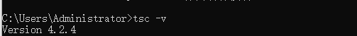

# TypeScript

## 1.准备环境

1. 将npm环境转为cnpm

   ~~~
   npm install -g cnpm --registery=https://registery.npm.taobao.org
   ~~~

2. 安装typescrit

   ~~~
   cnpm install -g typescript
   ~~~

3. 验证是否安装成功

   ~~~
   tsc -v
   ~~~

   

4. 新建ts文件

   ~~~typescript
   console.log("你好ts");
   ~~~

5. 编译ts文件为js文件

   ~~~
   tsc .\HelloWorld.ts
   ~~~

运行第五步如果报错可以看这个网址

> https://blog.csdn.net/dujyong/article/details/106359483

## 2.数据类型

> [声明符] [变量名]:[数据类型] = [数据]	

~~~typescript
let str:string = "我是TypeScript"
~~~

~~~typescript
//表示四季这种情况 定义一个枚举类型的变量  定义枚举的关键字是enum
//一般枚举类型的变量 用大写字母表示
enum SEASON{
    SPR,//结果一般也用大写字母表示
    SUM,//结果之间用逗号隔开
    AUT,
    WIN
}
console.log(SEASON.SPR);//0

enum CUP_TYPE{
  //在ts中会给每一个可能的结果赋值一个整数 方便在计算机中存储和使用 默认是0
  SMALL_CBIG_CUP_TYPE = 1，
  MID_CUP_TYPE,//2
  BIG_CUP_TYPE // 3
}
console.log( CUP_TYPE.MID_CUP_TYPE);
~~~

| TypeScript 中的数据类型有 |                    |
| ------------------------- | ------------------ |
| `Undefined`               | undefind类型       |
| `Number`                  | 数值类型           |
| `string`                  | 字符串类型         |
| `Boolean`                 | 布尔类型           |
| `enum`                    | 枚举类型           |
| `any`                     | 任意类型           |
| `void`                    | 空类型             |
| `Array`                   | 数组类型           |
| `Tuple`                   | 元祖类型           |
| `Null`                    | 空类型             |
| `Never`                   | 永不存在的值的类型 |

## 3. 方法返回类型

1. ​	

   ~~~typescript
   function [[方法名]()]():[返回类型]{...}
   
   function xuan():number{
       return 1;
   }
   ~~~

   

2. 方法可选参数

   ~~~typescript
   function getinfo(name:string,age?:number):string{}
   
   getinfo("我爱你",2)
   getinfo("我爱你")
   
   function getinfo2(name:string,age:number = 2):string{}
   ~~~

3. 方法重载

   ~~~typescript
   function getInfo(name:string):string;
   
   function getInfo(name:string,age:number):string;
   
   function getInfo(name:any,age?:any):any{
       ...
   }
   ~~~

   

4. 方法属性修饰符

   > public：共有的	protected：保护的	private：私有的
   >
   > public ->全局	protected -> 子类和本类 	private ->本类

5. 方法及继承

   ~~~typescript
   class Person{
   
       protected name:string;
   
       constructor(n:string){
           this.name = n;
       }
   
       run():void{
   
       }
   }
   
   class Web extends Person{
   
       constructor(n:string){
           super(n);
       }
   }
   ~~~

   

6. 静态方法

   ~~~typescript
   class Person{
   
       run():void{
   
       }
       static print(){
           
       }
   }
   
   
   Person.point();
   ~~~

7. 接口

   ~~~typescript
   interface FullName{
       firstName:string;
       secondName:string;
   }
   
   function printName(name:FullName){
   
       console.log(name.firstName+'--'+name.secondName);
       
   }
   
   printName({firstName:"小浅",secondName:'轩'})
   ~~~

8. 所有Java特效TypeScript都具有差不多